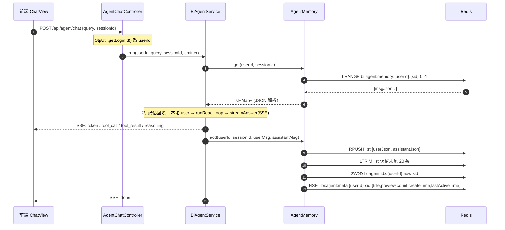
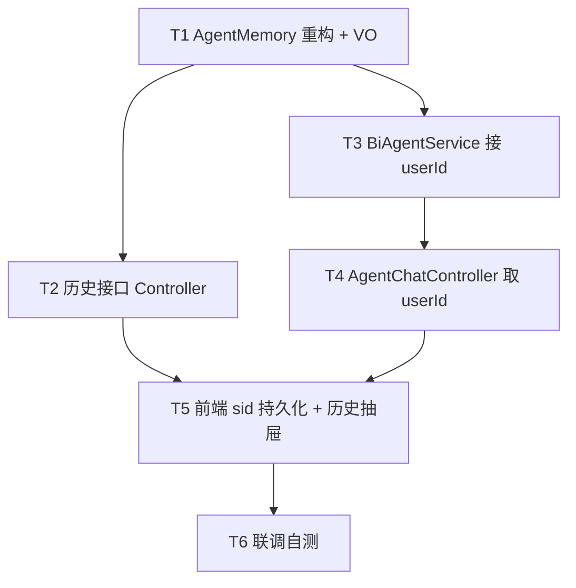

# 增量技术方案 + 任务分解：Agent 记忆 Redis 持久化 + 历史记录

> 文档归属：架构师（高见远 / Bob）｜ 面向工程师（T 系列任务）
> 范围：**增量改造**，不重写既有系统。聚焦"内存记忆 → Redis 持久化"与"新增历史记录查看/回溯/清空"。
> 现状基线：已对照 `AgentMemory.java` / `BiAgentService.java` / `AgentChatController.java` / `ChatReq.java` / `RedisConfig.java` / `application.yml` / `ChatView.vue` 实测确认。

---

## 0. 现状摘要（增量改造基线）

| 现状项 | 实测结论 |
|--------|----------|
| `AgentMemory` | 内存 `ConcurrentHashMap<String, Deque<Map>>`，`MAX_TURNS=10`，`get/add/clear` 三方法，**无 userId**。 |
| `BiAgentService.doRun` | `memory.get(sid)` 回填 → `messages.add(user)` → `runReactLoop` → `streamAnswer` → `memory.add(sid, user, assistant)` → `emitDone()`。 |
| `AgentChatController` | `POST /api/agent/chat` SSE；`agentService.run(req.query(), req.sessionId(), emitter)`；**未取 userId**。 |
| `ChatReq` | `record(query, @Size(max=64) sessionId)`；**无 userId 字段**（userId 必须由服务端从 Sa-Token 取，禁止客户端传入）。 |
| `RedisConfig` | 提供 `RedisTemplate<String,Object>`（**JDK 二进制序列化**，供 Sa-Token 用）；**`StringRedisTemplate` 由 starter 自动提供且当前未使用**。 |
| `application.yml` | `spring.data.redis` → `127.0.0.1:6379` 无密码，database=0；Sa-Token `1.44.0` 已接 Redis DAO。 |
| 依赖 | **fastjson2**（已引）、**spring-boot-starter-data-redis**（已引，含 `StringRedisTemplate`）、**Sa-Token 1.44.0**（已引）。**本次无需新增任何依赖**。 |
| 前端 `ChatView.vue` | `sessionId = ref(genSid())`，`genSid()` 每次生成、`newSession()` 静默丢旧 sid、**不存 localStorage**；渲染仅靠 SSE 事件增量拼接。`localStorage` 仅用了 `bi_token` / `bi_theme`。 |
| 登录主体 | `StpUtil.login(username)` → `getLoginId()` 返回 **username（String）**；故 `userId = String.valueOf(StpUtil.getLoginId())`。 |

---

## 1. 实现方案与框架选型

### 1.1 序列化选型（主理人已拍板）
- **采用 `StringRedisTemplate` + fastjson2**：每条消息（`Map<String,Object>`）序列化为 **JSON 字符串**存入 Redis `List`。
- 理由：
  1. 现有 `RedisTemplate<String,Object>` 被配置为 **JDK 二进制序列化**（专供 Sa-Token），用它存我们的 JSON 会二次序列化、不可读、难调试。
  2. `StringRedisTemplate` 的 key/value 均为 `String` 编码，value 直接存 JSON 文本，**人眼可读、便于 `redis-cli` 排查**，优于 JDK 二进制。
  3. `StringRedisTemplate` 由 `spring-boot-starter-data-redis` 自动装配，**无需改 `RedisConfig`**，与 Sa-Token 的模板互不干扰。
- JSON 工具：复用 `com.alibaba.fastjson2.JSON`（`JSON.toJSONString` / `JSON.parseObject`），不引入新 JSON 库。

### 1.2 索引方案（轻量、避免全量 SCAN）
- **每用户一个 ZSet**：`member = sid`，`score = 最后活跃时间毫秒` —— 支撑"按最后活跃时间倒序 + 分页"（`ZREVRANGE`）。
- **每用户一个 Hash**：`field = sid`，`value = JSON{title, preview, count, createTime, lastActiveTime}` —— 支撑列表详情，避免对每条 memory 再 `LRANGE`。
- 列表查询：`ZCARD` 取总数 → `ZREVRANGE idx start stop` 取本页 sid → `HMGET meta [sid...]` 取详情 → 组装 `SessionSummaryVo`。

### 1.3 架构与接口语义约束
- 保持既有 Spring Boot + SSE 流式架构不变。
- `AgentMemory` 由内存改为 Redis；**`get/add/clear` 对外语义保持不变**（仅新增 `userId` 入参）。
- 新增能力：`clearAll(userId)`、`listSessions(userId,page,size)`、`getSession(userId,sid)`。
- **滑动裁剪保持 `MAX_TURNS=10`（即 20 条）不变**：用 `List` + `LTRIM` 保留末尾 20 条，等价原 `while(size>20) removeFirst()`。
- **只存 user + assistant 最终答案**（决策①），不存 `tool_call/tool_result/reasoning`。
- **userId 透传边界**（决策⑦）：仅在 **Controller 层**经 `StpUtil.getLoginId()` 取 userId，向下传到 `BiAgentService` → `AgentMemory`；**不渗透到工具层 `AgentTool`**（工具层无需感知用户）。

### 1.4 历史粒度与标题（决策①②③）
- 标题：首条 user 提问 → 去换行/回车 → 截断 **20 字** + `…`（超出时）。
- 预览 `preview`：末条 assistant 答案 → 去换行 → 截断 **50 字** + `…`。
- `count`：Redis List 实际长度（即存储的消息条数），在 `LTRIM` 后取真实 `size`，避免与裁剪不一致。
- **本次不设 TTL**（决策③）：持久化，清理全靠"清空/单条删除"。

---

## 2. Redis Key 设计表

| 名称 | Key 模板 | 数据结构 | 存储内容 | TTL | 说明 |
|------|----------|----------|----------|-----|------|
| 记忆列表 | `bi:agent:memory:{userId}:{sid}` | Redis **List** | 每元素一条消息的 JSON 字符串（`{"role":"user","content":"..."}` / `{"role":"assistant","content":"..."}`） | **无** | `RPUSH` 追加；`LTRIM` 维持末尾 20 条窗口 |
| 索引 ZSet | `bi:agent:idx:{userId}` | Redis **ZSet** | `member = sid`，`score = 最后活跃时间(ms)` | **无** | 分页/排序依据；`ZREVRANGE` 倒序取页 |
| 元数据 Hash | `bi:agent:meta:{userId}` | Redis **Hash** | `field = sid`，`value = JSON{title, preview, count, createTime, lastActiveTime}` | **无** | 列表详情；`HSET/HGET/HDEL` |

> 常量定义位置（决策⑦）：上述 3 个前缀 + 分隔符统一声明为 `AgentMemory` 内 `private static final String`（如 `MEMORY_KEY_PREFIX="bi:agent:memory:"` 等），拼接 `userId` 与 `sid` 生成完整 key，**禁止散落硬编码**。

---

## 3. 数据结构与接口

### 3.1 类图（mermaid）

```mermaid
classDiagram
    class AgentMemory {
        -MAX_TURNS: int = 10
        -StringRedisTemplate redis
        +get(userId: String, sid: String): List~Map~String,Object~~
        +add(userId: String, sid: String, user: Map, assistant: Map): void
        +clear(userId: String, sid: String): void
        +clearAll(userId: String): void
        +listSessions(userId: String, page: int, size: int): PageResult~SessionSummaryVo~
        +getSession(userId: String, sid: String): SessionDetailVo
    }
    class AgentHistoryController {
        -AgentMemory memory
        -getUserId(): String
        +listSessions(page: int, size: int): Result~PageResult~SessionSummaryVo~~
        +getSession(sid: String): Result~SessionDetailVo~
        +deleteSession(sid: String): Result~Void~
        +clearAll(): Result~Void~
    }
    class AgentChatController {
        -BiAgentService agentService
        +chat(req: ChatReq): SseEmitter
    }
    class BiAgentService {
        -AgentMemory memory
        +run(userId: String, query: String, sid: String, emitter: SseEmitter): void
        -doRun(userId: String, query: String, sid: String, emitter: SseEmitter): void
    }
    class ChatReq {
        +query: String
        +sessionId: String
    }
    class SessionSummaryVo {
        +sessionId: String
        +title: String
        +preview: String
        +createTime: Long
        +lastActiveTime: Long
        +messageCount: Integer
    }
    class SessionDetailVo {
        +sessionId: String
        +title: String
        +messages: List~ChatMessageVo~
    }
    class ChatMessageVo {
        +role: String
        +content: String
    }
    class PageResult~T~ {
        +list: List~T~
        +total: Long
        +page: int
        +size: int
    }
    AgentChatController --> BiAgentService : run(userId,...)
    BiAgentService --> AgentMemory : get/add
    AgentHistoryController --> AgentMemory : list/get/clear/clearAll
    AgentMemory ..> SessionSummaryVo : 构造
    AgentMemory ..> SessionDetailVo : 构造
    PageResult ~-- SessionSummaryVo : 泛型 T
    SessionDetailVo *-- ChatMessageVo : messages
    AgentChatController ..> ChatReq : 入参
```

> 完整 class 图另存于 `class-diagram.mermaid`。

### 3.2 `AgentMemory` 重构后方法签名

| 方法 | 签名 | 行为说明 |
|------|------|----------|
| 取记忆 | `List<Map<String,Object>> get(String userId, String sid)` | `LRANGE memory:{userId}:{sid} 0 -1`，逐条 `JSON.parseObject` 还原为 `Map`；无 key 返回空列表（语义同现状）。 |
| 追加 | `void add(String userId, String sid, Map<String,Object> user, Map<String,Object> assistant)` | `RPUSH` 两条 JSON；`LTRIM` 保留末尾 20 条；首条时据 `user.content` 生成 `title`（截断 20）；`ZADD idx sid now`；`HSET meta sid {title, preview(来自assistant.content,截50), count=list.size(), createTime(首条为now), lastActiveTime=now}`。 |
| 单条清空 | `void clear(String userId, String sid)` | `DEL memory:{userId}:{sid}` + `ZREM idx sid` + `HDEL meta sid`。 |
| 清空全部 | `void clearAll(String userId)` | 取 `ZRANGE idx 0 -1` 得全部 sid → 逐个 `DEL` 其 memory list → `DEL idx` + `DEL meta`。 |
| 列表 | `PageResult<SessionSummaryVo> listSessions(String userId, int page, int size)` | `ZCARD` 总数；`ZREVRANGE idx start stop`（start=(page-1)*size）取本页 sid（倒序）；`HMGET meta [sid...]` 组装 `SessionSummaryVo`。 |
| 回溯详情 | `SessionDetailVo getSession(String userId, String sid)` | `LRANGE memory 0 -1` 解析为 `List<ChatMessageVo>`；`title` 取自 meta；返回 `SessionDetailVo`。 |

> 注：`add` 的 `user/assistant` 沿用现状 `Map.of("role","user/assistant","content",...)` 形态；标题/预览直接从 `user.get("content")` / `assistant.get("content")` 派生，**不新增入参**。

### 3.3 新增 VO 字段表（置于 `com.bi.agent.vo` 包）

| VO | 字段 | 类型 | 说明 |
|----|------|------|------|
| `SessionSummaryVo` | sessionId / title / preview / createTime / lastActiveTime / messageCount | String / String / String / Long / Long / Integer | 列表项；时间为毫秒时间戳。 |
| `SessionDetailVo` | sessionId / title / messages | String / String / `List<ChatMessageVo>` | 回溯详情。 |
| `ChatMessageVo` | role / content | String / String | 单条消息（user/assistant）。 |
| `PageResult<T>` | list / total / page / size | `List<T>` / Long / int / int | 通用分页包装，复用既有 `Result` 外层。 |

### 3.4 新增/调整 Controller 接口

> 采用**新建 `AgentHistoryController`**（与 `AgentChatController` 职责分离，更清晰；亦可在 `AgentChatController` 内追加，二者皆可，本设计取前者）。Base path：`/api/agent/history`。所有接口经 Sa-Token 拦截（沿用 `/api/**` 登录校验）。

| 方法 | 路径 | 入参 | 返回 | 说明 |
|------|------|------|------|------|
| GET | `/api/agent/history/list?page=1&size=20` | page,size（默认 1/20） | `Result<PageResult<SessionSummaryVo>>` | ④ 拉历史列表（按最后活跃倒序、分页、按 userId 隔离）。 |
| GET | `/api/agent/history/{sessionId}` | path sid | `Result<SessionDetailVo>` | ⑤ 回溯加载某会话全部 Q&A。 |
| DELETE | `/api/agent/history/{sessionId}` | path sid | `Result<Void>` | 单条删除某会话（决策④）。 |
| DELETE | `/api/agent/history/clear` | 无 | `Result<Void>` | 清空当前用户全部会话（决策④）。 |

> `AgentChatController.chat` 仅新增"取 userId 并透传"，**不改路径与 `ChatReq`**。

---

## 4. 程序调用流程（时序图）

### 4.1 聊天持久化流程（①②③）



### 4.2 历史查看 / 回溯 / 清空（④⑤⑥）

```mermaid
sequenceDiagram
    autonumber
    participant FE as 前端 ChatView / HistoryDrawer
    participant HC as AgentHistoryController
    participant M as AgentMemory
    participant R as Redis

    FE->>HC: GET /api/agent/history/list?page=1&size=20
    HC->>M: listSessions(userId, page, size)
    M->>R: ZCARD idx ; ZREVRANGE idx start stop
    R-->>M: [sid...] 倒序
    M->>R: HMGET meta [sid...]
    R-->>M: [metaJson...]
    M-->>HC: PageResult~SessionSummaryVo~
    HC-->>FE: 列表(标题/预览/时间/条数)

    FE->>HC: GET /api/agent/history/{sid}  (⑤ 点选回溯)
    HC->>M: getSession(userId, sid)
    M->>R: LRANGE memory:{userId}:{sid} 0 -1
    R-->>M: [msgJson...]
    M-->>HC: SessionDetailVo{messages}
    HC-->>FE: 渲染历史 Q&A 气泡；sessionId = sid
    Note over FE: 可在此基础上继续发问，新消息 append 到该 sid

    FE->>HC: DELETE /api/agent/history/{sid}  (⑥ 单条删除)
    HC->>M: clear(userId, sid)
    M->>R: DEL list ; ZREM idx sid ; HDEL meta sid

    FE->>HC: DELETE /api/agent/history/clear  (⑥ 清空全部)
    HC->>M: clearAll(userId)
    M->>R: 取全部 sid → DEL 各 list → DEL idx + meta
```

> 完整时序图另存于 `sequence-diagram.mermaid`。

---

## 5. 任务列表（T1–T6，有序、含依赖）

> 依主理人指定顺序拆分。依赖关系见 §9 依赖图。每个任务写清：改/建文件、做什么、验收点、依赖、优先级。

| 任务 | 标题 | 涉及文件 | 做什么 | 验收点 | 依赖 | 优先级 |
|------|------|----------|--------|--------|------|--------|
| **T1** | Redis 记忆基础设施重构 + VO | 改：`agent/AgentMemory.java`<br>新：`vo/SessionSummaryVo.java`<br>新：`vo/SessionDetailVo.java`<br>新：`vo/ChatMessageVo.java`<br>新：`vo/PageResult.java` | 用 `StringRedisTemplate`+fastjson2 重写 `AgentMemory`：实现 `get/add/clear`（语义不变，加 `userId`）+ 新增 `clearAll/listSessions/getSession`；key 常量内聚；JSON 序列化/反序列化；滑动 `LTRIM` 20 条；索引 ZSet+Hash 维护；定义 4 个 VO。 | 单测/手动：同 userId 多会话可正确 `get/add`；`listSessions` 倒序分页正确；`clear`/`clearAll` 后索引与 memory 同步消失；Redis 中 value 为可读 JSON。 | 无 | **P0** |
| **T2** | 历史接口 Controller + VO 接入 | 新：`controller/agent/AgentHistoryController.java` | 新建 Controller：`/history/list`、`/history/{sid}`(GET)、`/history/{sid}`(DELETE)、`/history/clear`(DELETE)；内部 `getUserId()` 经 `StpUtil.getLoginId()` 取 userId 并下传 `AgentMemory`；返回 `Result` 包装 VO。 | 接口返回结构符合 §3.4；**A 用户无法看到 B 用户会话**（userId 隔离生效）；空列表返回 `total=0`。 | T1 | **P0** |
| **T3** | BiAgentService 调用链加 userId 并接新 AgentMemory | 改：`agent/BiAgentService.java` | `run/doRun` 增加 `userId` 参数；`memory.get(userId, sid)` 回填、`memory.add(userId, sid, user, assistant)` 落盘；其余 ReAct/SSE 逻辑不变。 | 一次对话后：Redis 出现 `memory:{userId}:{sid}` 列表（含 user+assistant）、`idx` 有该 sid、`meta` 有标题/预览；下一轮对话能正确回填 10 轮窗口。 | T1 | **P0** |
| **T4** | AgentChatController 取 userId 传入 | 改：`controller/agent/AgentChatController.java` | `chat()` 内 `String userId = String.valueOf(StpUtil.getLoginId())`；调用 `agentService.run(userId, req.query(), req.sessionId(), emitter)`；`ChatReq` 不改。 | `/api/agent/chat` 端到端可用；未登录被 Sa-Token 拦截（沿用）；userId 正确落 Redis key。 | T3 | **P0** |
| **T5** | 前端 sid 持久化 + 历史抽屉 | 改：`agent-ui/src/views/ChatView.vue`<br>改：`agent-ui/src/api/agent.js`<br>新：`agent-ui/src/components/HistoryDrawer.vue` | ① `localStorage` 键 `bi_last_sid`：启动时恢复、切换/新建会话时写入；② 新增左侧抽屉 `HistoryDrawer`：列表（标题/预览/时间/条数）、点选回溯（`getSession` 渲染历史 Q&A 气泡并将 `sessionId` 设为该 sid，可继续发问）、单条删除、清空全部；③ `api/agent.js` 增加 `listHistory/pageHistory/getSession/deleteSession/clearSessions` 调用；④"新会话"按钮行为与抽屉不冲突。 | 刷新页面后恢复上次会话（不再丢）；抽屉能列/回溯/删/清空；回溯后继续提问的新消息 append 到同一 sid；与"新会话"无冲突。 | T2, T4 | **P0** |
| **T6** | 联调自测 | 改/新：`src/test/...`（可选 `AgentMemoryRedisTest`） | 串联验证：聊多轮→刷新/重启→记忆恢复；历史列表/回溯/删除/清空；用户隔离；20 条窗口裁剪。 | 全链路通过；Redis 中无孤儿 key（删除后 idx/meta/memory 一致）。 | T1–T5 | **P1** |

---

## 6. 依赖包列表（确认）

| 依赖 | 版本/状态 | 用途 | 是否新增 |
|------|-----------|------|----------|
| `com.alibaba.fastjson2:fastjson2` | 已引（项目既有） | 消息/元数据 JSON 序列化 | **否** |
| `spring-boot-starter-data-redis` | 已引 | 提供 `StringRedisTemplate`（自动装配、当前未用） | **否** |
| `sa-token-spring-boot3-starter` + `sa-token-redis-template` | 1.44.0 已引 | `StpUtil.getLoginId()` 取 userId | **否** |
| `StringRedisTemplate`（Spring 自动 Bean） | 随 starter 提供 | 存 JSON 字符串（key/value 均为 String） | **否** |

> **结论：本次无需新增任何第三方依赖。** 不修改 `RedisConfig`（保持 Sa-Token 的 `RedisTemplate<String,Object>` JDK 序列化不变），新增的 Agent 记忆改用独立的 `StringRedisTemplate`。

---

## 7. 共享知识（跨文件约定）

1. **Key 命名常量**：3 个前缀 + 分隔符集中声明于 `AgentMemory` 内 `private static final String`（`MEMORY_KEY_PREFIX="bi:agent:memory:"`、`INDEX_ZSET_PREFIX="bi:agent:idx:"`、`META_HASH_PREFIX="bi:agent:meta:"`）。完整 key = 前缀 + userId + ":" + sid（Hash/ZSet 只用前缀 + userId）。**禁止散落硬编码**。
2. **JSON 序列化工具**：统一 `com.alibaba.fastjson2.JSON.toJSONString(...)` / `JSON.parseObject(..., ...)`；消息 Map 与元数据 Map 均序列化为字符串存储；解析消息时还原为 `LinkedHashMap` 以保序。
3. **userId 取用约定**：仅在 **Controller 层** `String.valueOf(StpUtil.getLoginId())` 取得，**向下透传**至 `BiAgentService`→`AgentMemory`；**不进入工具层 `AgentTool`**；**绝不信任客户端传入的 userId**（`ChatReq` 保持无 userId 字段）。
4. **前端 localStorage 键**：`bi_last_sid`（最后活跃会话 sid）；既有 `bi_token` / `bi_theme` 不变。
5. **SSE 事件名不变**：`token / tool_call / tool_result / reasoning / done / error`；本次不改变 `AgentSession` 事件协议。
6. **接口 Base Path**：对话 `/api/agent/chat`；历史 `/api/agent/history/**`；均走 `/api/**` 的 Sa-Token 登录拦截。
7. **时间表示**：`createTime/lastActiveTime` 统一为 **毫秒时间戳（Long）**，由服务端 `System.currentTimeMillis()` 生成，前端按 locale 格式化展示。

---

## 8. 待明确事项（含已采纳的建议）

- **回溯后的渲染与续聊（决策⑧）**：建议——点选回溯后，对话区**以只读 Q&A 气泡重建历史问答**，同时把 `sessionId` 切到该 sid；用户可**在此基础上继续发问**，新消息经 SSE 产生并 **append 到同一 sid**（服务端 `get` 会回填该 sid 全部历史，保证多轮连贯）。本设计已按此采纳，前端 T5 据此实现。
- **分页默认与上限**：默认 `page=1, size=20`；建议 `size` 上限 50（防一次拉取过多），由 Controller 参数校验兜底（非阻塞项，可在 T2 顺带加 `@Max` 或手动 clamp）。
- **`preview` 截断长度**：本设计取 50 字（标题 20 字按 PRD）；若 PM 有不同预期，T1 实现时调整常量即可。
- **前端历史抽屉的"实时刷新"**：列表仅在打开抽屉/发完一轮后刷新即可，不做轮询（P2 多端同步不在本次范围）。

---

## 9. 任务依赖图（mermaid）


