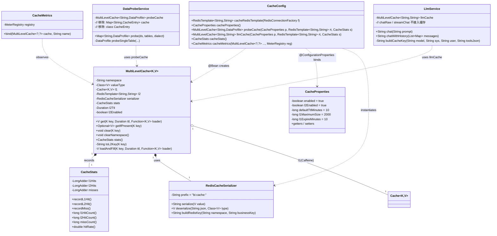
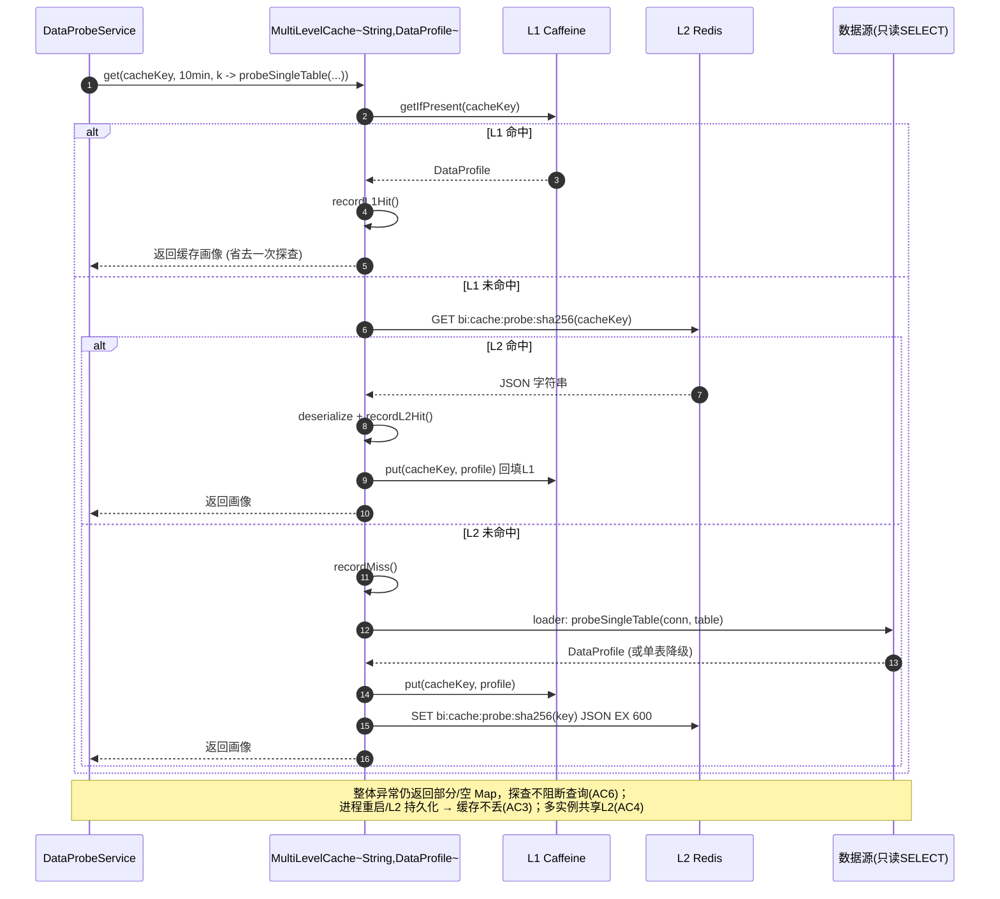
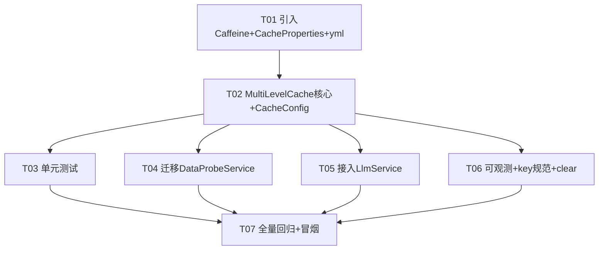

# 架构设计：agent_bi「真·多级缓存」（L1 本地 + L2 Redis）

> 文档类型：系统设计 + 任务分解（架构阶段产出，供工程师寇豆码实现）
> 作者：架构师 高见远 ｜ 语言：简体中文
> 配套输入：`/d/个人项目/agent_bi/PRD_multi_level_cache.md`
> 本期范围：**P0 全部 + 三个 P1 全部**；P2（AgentMemory 热会话 L1、压缩/淘汰可调）放下一期。
> 现状底座（已 grep 代码核实，非虚构）：
> - `AgentMemory`：`StringRedisTemplate` 三件套（`bi:agent:memory:` List / `bi:agent:idx:` ZSet / `bi:agent:meta:` Hash），持久化无过期。
> - `DataProbeService`：进程内裸 `ConcurrentHashMap<String, CacheEntry>`（key=`数据源ID:表名`，value 带过期时间戳，`CACHE_TTL_MINUTES=10`），重启即丢、多实例不共享。
> - `LlmService`：无任何缓存，每次直连网关；`chat`/`chatWithHistory`/`chatRaw`(含 tool_calls)/`streamChat`(SSE)。
> - `RedisConfig` 提供 `RedisTemplate<String,Object>`（JDK 序列化）——**不可直接用于缓存**（value 为二进制 blob、与 `bi:agent:*`/SaToken 混用同一模板易污染），缓存需独立 `RedisTemplate<String,String>`。

---

## A. 实现方案 + 框架选型

### A.1 技术选型

| 层级 | 选型 | 理由 | 与 Spring Boot 3.4.5 / Java 21 兼容性 |
|------|------|------|----------------------------------------|
| **L1 本地** | **Caffeine 3.1.8**（`com.github.ben-manes.caffeine:caffeine`） | 高性能本地缓存；原生支持 `expireAfterWrite`（对齐 DataProbe 现有 TTL 语义）、`maximumSize`（容量上限）、`recordStats()`（命中率，供 P1-1）；其 `Cache.get(key, loader)` 即"同步 read-through"，与组件模型天然契合。 | Caffeine 3.x 要求 Java 11+，**Java 21 无碍**；Apache-2.0 许可、体积小（~1.5MB，仅依赖 `com.google.errorprone:error_prone_annotations`）。 |
| **L2 远程** | **复用现有 Redis 实例**（Spring Boot 自动配置的 `RedisConnectionFactory`，来自 `spring.data.redis`，Phase 1 已接 SaToken） | 零新增中间件、零运维面；命名空间前缀隔离即可避免与 `bi:agent:*`、SaToken 冲突。 | Spring Data Redis 随 Boot 3.4.5 自带，Java 21 无碍。 |

### A.2 组件形态与 API

- **核心组件**：泛型 Spring `@Component` `MultiLevelCache<K, V>`，封装 L1(Caffeine) + L2(Redis)，对外屏蔽两级差异，业务方**只调一个 read-through 入口**，无需自行编排 L1/L2 查询与回填顺序（满足 P0-1 AC1/AC2）。
- **装配方式**：`CacheConfig`（`@Configuration`）按命名空间**直接 `@Bean` 出具体实例**——`probeCache`（`MultiLevelCache<String, DataProfile>`，TTL 10min）与 `llmCache`（`MultiLevelCache<String, String>`，TTL 30min）。这是最清晰、最贴近实现的形态；后续若 namespace 增多，可平滑升级为 `MultiLevelCacheManager` 工厂（本方案已预留）。
- **对外 API（方法级）**：
  - `V get(K key, Duration ttl, Function<K, V> loader)` —— **read-through 主入口**：查 L1 → 未命中查 L2 → 再未命中调用 `loader` 回源，并把结果同时写回 L1 与 L2（带 TTL）。
  - `Optional<V> getIfPresent(K key)` —— 只读不回源（本期不强制使用，预留）。
  - `void clear(K key)` —— 主动失效单 key（同时 invalidate L1 + del L2）。
  - `void clearNamespace()` —— 按命名空间批量失效（见 Q6 扩展点注释）。
  - `CacheStats stats()` —— 返回命中/未命中计数与命中率（P1-1）。
- **写入语义（据 Q1）**：**不提供 `put` 双写接口**。写只走业务原路径；缓存仅在 `get` 回源时"回填"。一致性靠 `clear`/`clearNamespace` 主动失效 + TTL 兜底（详见 §D/Q1）。

### A.3 序列化（L1 / L2）

- **L1（Caffeine，堆内）**：直接持有 Java 对象引用，**无需序列化**。
- **L2（Redis）**：新建**独立的** `RedisTemplate<String, String>`（即 `StringRedisTemplate` 风格），key 与 value 均为 `String`：
  - **key**：`bi:cache:{namespace}:{sha256(businessKey)前32位hex}`——对 businessKey 做 SHA-256 取前 32 位，保证 Redis key 长度固定、无特殊字符、全局唯一（DataProbe 的 `dsId:tableName` 与 LLM 的长 prompt 哈希串都安全）。
  - **value**：`com.alibaba.fastjson2.JSON.toJSONString(v)`（项目**已引入** fastjson2 2.0.53，统一复用，不再引 Jackson 以免多套 JSON 栈）。反序列化用 `JSON.parseObject(json, valueType)`，`valueType` 在 Bean 创建时显式传入（规避泛型擦除）。
- **为何不复用现有 `RedisConfig` 的 `RedisTemplate<String,Object>`**：其 value 用 `JdkSerializationRedisSerializer`（二进制 blob），不可读、跨语言差、且与 SaToken/AgentMemory 共用同一模板会污染 `bi:*` 命名空间。独立模板隔离更干净（满足 P1-2 AC3）。

---

## B. 数据与接口（类图，Mermaid）

> 另存见 `docs/architecture/class-diagram.mermaid`。



**read-through 流程（文字版，对齐 P0-1 AC2/AC4/AC5）**：
1. `get(key, ttl, loader)` 先查 L1（Caffeine `getIfPresent`）→ 命中：`stats.recordL1Hit()`，返回。`stats` 用 `LongAdder`。
2. L1 未命中 → 计算 L2 key（`bi:cache:{ns}:sha256(key)`）→ `l2.opsForValue().get(l2Key)`：
   - 命中：`stats.recordL2Hit()`，反序列化，`l1.put(key, value)` 回填 L1（用 L1 自身 TTL），返回。
   - 未命中：`stats.recordMiss()`，调用 `loader.apply(key)` 回源。
3. 回源成功 → `l1.put(key, value)`（L1 `expireAfterWrite`）+ `l2.opsForValue().set(l2Key, serialize(value), ttl)`（L2 TTL = 传入 `ttl`）。返回 value。
4. 任一异常：`loader` 异常向上抛（业务原语义，DataProbe/LlmService 各自降级/异常透传不变），**不写缓存**（避免缓存脏值/异常）。
5. `clear(key)`：`l1.invalidate(key)` + `l2.delete(l2Key)`。`clearNamespace()`：`l2.keys(namespacePrefix + "*")` 批量 `delete`（L1 跨实例无法批量清，依赖 TTL 兜底；见 Q6 注释扩展点）。

---

## C. 程序调用流程（时序图，Mermaid）

> 另存见 `docs/architecture/sequence-diagram.mermaid`。两张图：① DataProbe 经组件查探查结果；② LlmService 经组件查 LLM 响应。

### 图① DataProbeService → MultiLevelCache → 探查结果



### 图② LlmService → MultiLevelCache → LLM 响应

```mermaid
sequenceDiagram
    autonumber
    participant LLM as LlmService
    participant MLC as MultiLevelCache~String,String~
    participant L1 as L1 Caffeine
    participant L2 as L2 Redis
    participant GW as AI 网关(chat/completions)

    LLM->>LLM: cacheKey = sha(model+systemPrompt+userPrompt+toolsJson)  // 不区分用户
    LLM->>MLC: get(cacheKey, 30min, k -> postForJson(gateway))
    MLC->>L1: getIfPresent(cacheKey)
    alt L1 命中
        L1-->>MLC: 响应文本
        MLC->>MLC: recordL1Hit()
        MLC-->>LLM: 直接返回 (不再调网关, AC2)
    else L1 未命中
        MLC->>L2: GET bi:cache:llm:sha256(cacheKey)
        alt L2 命中
            L2-->>MLC: JSON 字符串
            MLC->>MLC: deserialize + recordL2Hit()
            MLC->>L1: put 回填
            MLC-->>LLM: 返回响应
        else L2 未命中
            MLC->>MLC: recordMiss()
            MLC->>GW: postForJson(/chat/completions)
            GW-->>MLC: 响应文本 (401/403/429 等异常照常透传, AC3)
            MLC->>L1: put(cacheKey, text)
            MLC->>L2: SET bi:cache:llm:sha256(key) JSON EX 1800
            MLC-->>LLM: 返回响应
        end
    end
    Note over LLM: streamChat / chatRaw(含tool_calls) 默认不进缓存(见Q2);<br/>端到端行为与现状一致,仅多一次缓存填充(AC4)
```

---

## D. 待确认问题（Q1–Q6）的明确决策 + 理由

> 以下均**当场拍板**，不留"待定"。若用户/主理人坚持另选，工程师在实现前知会架构师即可调整。

| 编号 | 决策 | 理由 |
|------|------|------|
| **Q1** 一致性策略 | **read-through + 主动失效（write-around）**。写入只走业务原路径；缓存仅在 `get` 回源时回填；提供 `clear(key)` / `clearNamespace(ns)` 主动失效。**不采用** write-through / write-behind。 | `DataProbeService` 与 `LlmService` 都是"读多、写由业务触发/无显式写"的场景。write-through 需双写（业务库 + 缓存）保证一致，write-behind 还要异步队列与失败补偿——二者都显著增加复杂度与一致性风险，而收益有限（这两个场景几乎没有"先写缓存再读"的需求）。主动失效 + TTL 兜底已能满足 P0-1 AC3/AC5。→ 据此定 **P0-1 写入语义**。 |
| **Q2** LLM 缓存 key 维度 | key = `sha256(model + systemPrompt + userPrompt + toolsJson)`；**不区分用户**（按用户隔离会大幅降低命中率且语义无必要——相同输入模型返回相同结果）；**TTL = 30 分钟**（平衡时效与命中）；**`streamChat` 与 `chatRaw`（含 tool_calls）默认不缓存**——流式无法缓存部分结果、tool_calls 含模型自决动作不应复用。仅缓存 `chat` / `chatWithHistory` 的最终完成文本。 | 命中范围与时效是 P0-3 关键点。不区分用户既提升命中又避免"串用户"风险（因相同输入即相同输出，无用户态差异）；30min 对 NL2SQL/对话重复提问足够；流式与 tool_calls 场景缓存无意义且易出错。 |
| **Q3** AgentMemory 纳入 | **本期不纳入**，保持独立（List/ZSet/Hash 三件套非纯 KV，强套 KV 抽象反而别扭）。**P2-1** 后续单独评估（仅给热读取加 L1）。 | 结构特殊，强行套进 `MultiLevelCache<K,V>` 会扭曲组件设计；等 P0/P1 在 DataProbe/LlmService 跑稳后再推广更稳妥。 |
| **Q4** Caffeine 引入 | **允许引入 `com.github.ben-manes.caffeine:caffeine:3.1.8`**。 | Java 21 兼容、Apache-2.0、体积小、零额外运维；是 Spring 官方推荐的本地缓存方案。 |
| **Q5** L2 复用 | **复用现有 Redis 实例**；命名空间前缀 `bi:cache:{namespace}:`（与 `bi:agent:*`、SaToken 隔离）；Redis 侧 `maxmemory-policy` 维持现状，**建议改为 `allkeys-lru`**（运维建议，非强改）。 | 零新增中间件；前缀隔离避免 key 冲突（P1-2 AC3）；`allkeys-lru` 可在内存压力下自动淘汰，保护稳定性。 |
| **Q6** 多实例 L1 失效广播 | **本期不引入 Pub/Sub**，接受"L2 失效后各实例 L1 靠 TTL 兜底短暂不一致"。探查 TTL=10min、LLM TTL=30min，窗口很短、风险可接受。在 `clearNamespace()` 实现里保留"未来可接广播"的扩展点注释。 | Pub/Sub 增加复杂度与运维面，本期范围外；TTL 兜底对当前场景充分。 |

---

## E. 文件列表及相对路径（本次新增 / 修改）

> 均在 `bi-agent-platform/src/main/java/com/bi/agent/` 下（除非注明）。相对路径以 `bi-agent-platform/` 为根。

### 新增（缓存框架包 `cache/`）

| 路径 | 作用 |
|------|------|
| `src/main/java/com/bi/agent/cache/MultiLevelCache.java` | **核心组件**。泛型 `<K,V>`：L1 Caffeine + L2 独立 `RedisTemplate<String,String>` 装配、`get`(read-through)、`getIfPresent`、`clear`、`clearNamespace`、`stats`；构造时传入 `namespace` / `valueType` / `CacheProperties` / `CacheStats` / `RedisCacheSerializer`。 |
| `src/main/java/com/bi/agent/cache/CacheProperties.java` | `@ConfigurationProperties("bi.cache")`：`enabled`、`l2Enabled`、`defaultTtlMinutes`(默认10)、`l1MaximumSize`(默认2000)、`l1ExpireMinutes`(默认10)。 |
| `src/main/java/com/bi/agent/cache/CacheStats.java` | 命中率统计，字段用 `LongAdder`（并发安全）：`l1Hits`/`l2Hits`/`misses` + `hitRate()`。 |
| `src/main/java/com/bi/agent/cache/RedisCacheSerializer.java` | L2 序列化：`serialize(V)->String`(fastjson2)、`deserialize(String,Class)->V`、`buildRedisKey(ns, businessKey)`（SHA-256 前 32 位 hex，前缀 `bi:cache:`）。 |
| `src/main/java/com/bi/agent/cache/CacheConfig.java` | `@Configuration`：① 装配独立 `RedisTemplate<String,String>`（fastjson2 字符串模板，不复用 `RedisConfig`）；② `@Bean CacheProperties`；③ `@Bean CacheStats`；④ `@Bean probeCache`(`<String,DataProfile>`, TTL=10min)；⑤ `@Bean llmCache`(`<String,String>`, TTL=30min)；⑥（可选）`@Bean CacheMetrics`。 |
| `src/test/java/com/bi/agent/cache/MultiLevelCacheTest.java` | 单元测试：Mock `RedisTemplate` 验证 L1 命中 / L2 命中 / 回源回填两级 / `clear` 双失效 / `stats` 计数；可选 embedded-redis 集成验证跨重启不丢。 |

### 修改

| 路径 | 改动 |
|------|------|
| `src/main/java/com/bi/agent/bi/service/probe/DataProbeService.java` | 移除 `Map<String,CacheEntry> cache` 与内部类 `CacheEntry`；注入 `MultiLevelCache<String,DataProfile> probeCache`；`probe()` 内 `cacheKey = ds.getId()+":"+t` 命中判断改为 `probeCache.get(cacheKey, Duration.ofMinutes(10), k -> probeSingleTable(...))`；TTL 走 `ProbeConstants.CACHE_TTL_MINUTES` 或 `bi.probe.cache.ttl-minutes` 覆盖；**保留整体异常降级（返回部分/空 Map）不变**。 |
| `src/main/java/com/bi/agent/bi/service/llm/LlmService.java` | 注入 `MultiLevelCache<String,String> llmCache`；新增 `buildCacheKey(model, systemPrompt, userPrompt, toolsJson)`（sha256 拼接，不区分用户）；在 `chat(String)` / `chat(String,double)` / `chatWithHistory(...)` 入口计算 key 并 `llmCache.get(key, Duration.ofMinutes(30), k -> postForJson(...))`；**`chatRaw` / `streamChat` 不接入缓存**；401/403/429 异常透传与降级逻辑原样保留。 |
| `src/main/resources/application.yml` | 补 `bi.cache.*` 配置段（`enabled`、`l2Enabled`、`default-ttl-minutes`、`l1-maximum-size`、`l1-expire-minutes`）与 `bi.probe.cache.ttl-minutes: 10`（覆盖点）。 |

### 可选（P1-1 建议项，本期建议做）

| 路径 | 作用 |
|------|------|
| `src/main/java/com/bi/agent/cache/CacheMetrics.java` | Micrometer `MeterRegistry` 绑定 `CacheStats`（counter: `cache.l1.hits` / `cache.l2.hits` / `cache.misses`；gauge: `cache.hit.rate`），供 actuator 暴露（P1-1 AC3）。`io.micrometer:micrometer-core` 已随 `spring-boot-starter-actuator` 引入，无需新增依赖。 |

---

## F. 任务列表（有序、含依赖、按实现顺序）

> 工程师可逐步执行。依赖尽量扁平（T04/T05/T06 并行依赖 T02；T07 收口）。

| 任务ID | 任务名 | 源文件（新增/修改） | 依赖 | 优先级 |
|--------|--------|---------------------|------|--------|
| **T01** | 引入 Caffeine 依赖 + `CacheProperties` + `application.yml` 补 `bi.cache.*` 段 | `pom.xml`（新增 caffeine 依赖）；`cache/CacheProperties.java`（新增）；`src/main/resources/application.yml`（修改） | 无 | P0 |
| **T02** | 实现 `MultiLevelCache` 核心（L1+L2 装配、read-through、clear/clearNamespace、stats）+ `RedisCacheSerializer` + `CacheConfig` 装配 Bean | `cache/MultiLevelCache.java`、`cache/RedisCacheSerializer.java`、`cache/CacheStats.java`、`cache/CacheConfig.java`（均新增） | T01 | P0 |
| **T03** | 单元测试 `MultiLevelCache`（Mock `RedisTemplate` 验证 L1命中/L2命中/回源回填/失效/stats；可选 embedded-redis 集成） | `src/test/java/com/bi/agent/cache/MultiLevelCacheTest.java`（新增） | T02 | P1 |
| **T04** | 迁移 `DataProbeService`（移除 `ConcurrentHashMap` 与 `CacheEntry`，注入 `probeCache`，TTL 10min，保留降级） | `bi/service/probe/DataProbeService.java`（修改） | T02 | P0 |
| **T05** | 接入 `LlmService`（`chat`/`chatWithHistory` 接 `llmCache`，按 Q2 key 维度，TTL 30min；`streamChat`/`chatRaw` 不缓存） | `bi/service/llm/LlmService.java`（修改） | T02 | P0 |
| **T06** | 可观测 + key 规范 + clear 接口落地（P1-1 命中日志/`CacheMetrics`；P1-2 key 命名规范固化到 `RedisCacheSerializer` 常量与注释；P1-3 `clear`/`clearNamespace` 已在 T02 实现，此处补缓存命中 INFO 日志与可选 `CacheMetrics` Bean） | `cache/CacheConfig.java`（补 `CacheMetrics` Bean，可选）、`cache/MultiLevelCache.java`（补命中/回填 INFO 日志）、`cache/RedisCacheSerializer.java`（命名规范常量注释） | T02 | P1 |
| **T07** | 全量回归（`mvn test` 全绿）+ 启动冒烟（验证 SaToken/Redis 仍正常、`probeCache`/`llmCache` Bean 装配无误、缓存命中日志可见） | 无新增（验证性） | T03,T04,T05,T06 | P0 |

**执行顺序建议**：T01 → T02 → （T03 ∥ T04 ∥ T05 ∥ T06）→ T07。其中 T03/T04/T05/T06 相互独立，可并行；T07 为收口闸门。

### 任务依赖图（Mermaid）



---

## G. 依赖包列表（Maven）

| groupId:artifactId:version | 作用 | 状态 |
|----------------------------|------|------|
| `com.github.ben-manes.caffeine:caffeine:3.1.8` | **L1 本地缓存**（新引入，唯一新增依赖） | **新增** |
| `com.alibaba.fastjson2:fastjson2:2.0.53` | L2 value 序列化（已存在，显式声明复用，不另引 Jackson） | 已存在 |
| `org.springframework.boot:spring-boot-starter-data-redis` | 提供 `RedisConnectionFactory`（L2 基础，已存在） | 已存在 |
| `io.micrometer:micrometer-core` | `CacheMetrics` 指标（随 `spring-boot-starter-actuator` 已引入） | 已存在 |
| `org.springframework.boot:spring-boot-starter-test` | 单元测试（Mockito/JUnit5，已存在） | 已存在 |
| `com.github.codemonstur:embedded-redis:1.4.3` | 测试期自包含 Redis（可选集成测试，已存在） | 已存在 |

> 结论：**运行期真正新增的 Maven 依赖只有 `caffeine:3.1.8`**；其余均已就绪。

---

## H. 共享知识（跨文件约定，工程师务必遵守）

1. **key 命名规范（P1-2 AC1/AC2/AC3）**：
   - L2 Redis key = `bi:cache:{namespace}:{sha256(businessKey)前32位hex}`，前缀常量集中在 `RedisCacheSerializer.PREFIX = "bi:cache:"`。
   - `namespace` 取值：`probe`（探查）、`llm`（LLM 响应）；新增场景需新增命名空间常量，**不得**与 `bi:agent:*`、SaToken key 冲突。
   - L1（Caffeine）key = 原始 `businessKey`（如 `dsId:tableName` 或 LLM 的 sha256 串）；L1 与 L2 逻辑 key 都由同一 `businessKey` 唯一推导（一致失效可行）。
2. **TTL 单位约定**：配置用"分钟"（`bi.cache.default-ttl-minutes` 等），组件内统一转 `Duration`；L1 `expireAfterWrite`，L2 `Redis` `EXPIRE`。DataProbe=10min（可 `bi.probe.cache.ttl-minutes` 覆盖），LLM=30min（见 Q2）。
3. **序列化统一 fastjson2**：L2 value 一律 `JSON.toJSONString` / `JSON.parseObject(json, valueType)`，不混用 Jackson/JDK。
4. **stats 线程安全**：`CacheStats` 计数一律用 `LongAdder`（高并发累加无锁），`hitRate()` = `(l1Hits+l2Hits) / (l1Hits+l2Hits+misses)`。
5. **Caffeine 默认容量**：`maximumSize=2000`，`expireAfterWrite` 默认 10min，均可在 `bi.cache.*` 覆盖。
6. **失效语义**：`clear(key)` 双级同清；`clearNamespace()` 清 L2（批量 del）+ L1 仅本实例清，跨实例 L1 靠 TTL 兜底（Q6）。**回源异常不写缓存**。
7. **Bean 隔离**：缓存用独立 `RedisTemplate<String,String>`，**不复用** `RedisConfig` 的 `RedisTemplate<String,Object>`（避免 JDK 序列化 blob 污染 `bi:*` 命名空间）。
8. **降级/透传不变**：`DataProbeService` 整体异常仍返回部分/空 Map；`LlmService` 401/403/429 等仍按现状抛出/处理——缓存层不得吞异常或改变业务错误语义。

---

## I. 待明确事项

**无。** Q1–Q6 已由架构师在 §D 全部拍板（含理由），无需用户/主理人再确认。唯一可调项是各 TTL 数值（探查 10min、LLM 30min）与 Redis `maxmemory-policy`（建议 `allkeys-lru`），均已在对应章节给出默认值与"若用户坚持另选则改"的标注，不构成阻塞。

---

## 核心架构决策总结（一段话）

本期构建一套泛型 Spring 组件 `MultiLevelCache<K,V>`：L1 用 **Caffeine 3.1.8**（堆内、read-through 自动回填、命中率统计），L2 **复用现有 Redis 实例**（独立 `StringRedisTemplate` + fastjson2 序列化，前缀 `bi:cache:{ns}:`，与 `bi:agent:*`/SaToken 隔离）；**一致性采用 Q1 推荐的 read-through + 主动失效（write-around）**——写只走业务原路径、缓存仅回源时回填、提供 `clear/clearNamespace` 主动失效，规避 write-through/behind 的双写与异步复杂度；**LLM 缓存按 Q2 决策**：key = `sha256(model+systemPrompt+userPrompt+toolsJson)`、不区分用户、TTL 30min，且 `streamChat`/`chatRaw` 不缓存；先把现状两大痛点（DataProbeService 裸 `ConcurrentHashMap` 重启丢/多实例不共享、LlmService 无缓存浪费 token）消化进同一抽象，并以 P1 的命中率可观测、key 命名规范、手动失效能力让"真·多级缓存"可用可管，AgentMemory 与压缩/淘汰可调留待 P2。
