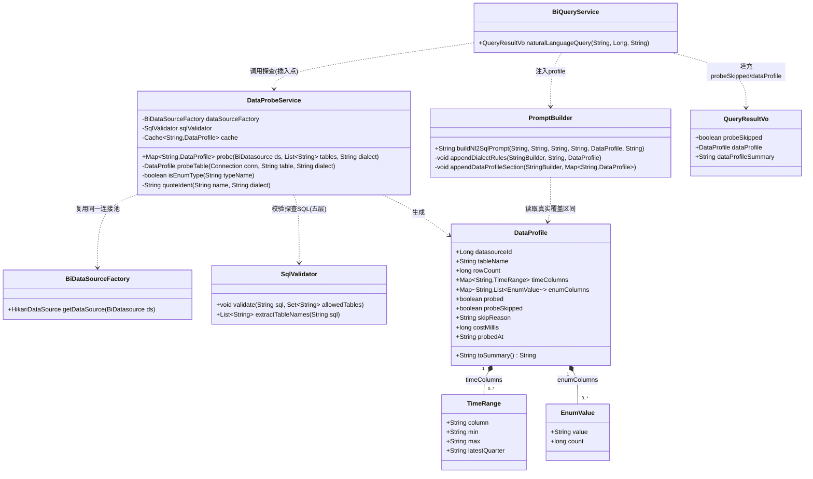
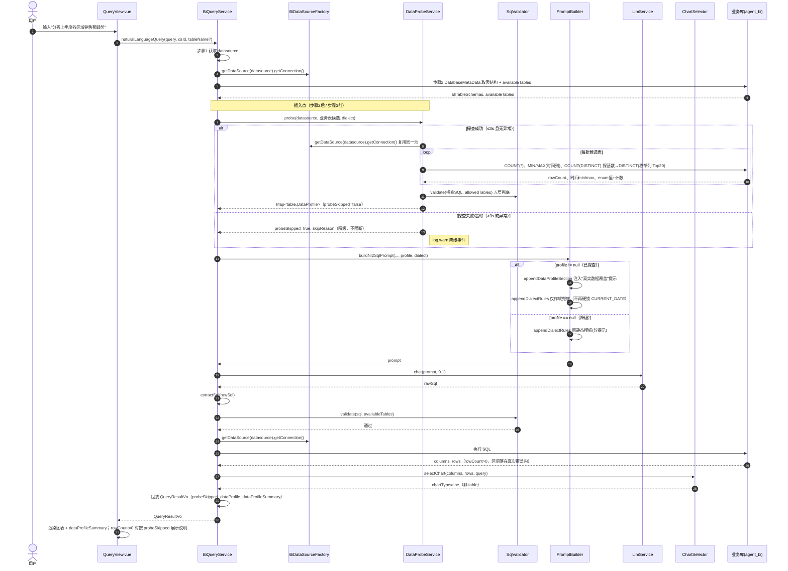

# 系统架构设计：NL2SQL 数据探查前置（DataProfile）增量改造

> 角色：架构师（高见远 / Bob）
> 性质：基于现有代码的**增量改造**设计（非从零设计）
> 依据：产品经理许清楚的增量 PRD + 主理人补充的诊断铁证 + 主理人预设默认决策
> 代码锚点已逐文件核对（路径：`bi-agent-platform/src/main/java/com/bi/agent/bi/` 与 `agent-ui/src/`）

---

## 一、实现方案 + 框架选型

### 1.1 是否新增 `DataProbeService`
**是。** 新增独立服务 `com.bi.agent.bi.service.probe.DataProbeService`，职责单一：在 NL2SQL 生成前，对候选业务表做轻量元数据探查，产出结构化 `DataProfile`，注入 Prompt。与现有 `BiQueryService`（流程编排）、`PromptBuilder`（Prompt 拼接）、`SqlValidator`（安全校验）低耦合协作。

### 1.2 探查用原生 JDBC 还是 MyBatis
**原生 JDBC（`java.sql`）。** 理由：
- 探查 SQL 完全由 `DatabaseMetaData` 返回的表名/列名动态拼装，是一次性、参数无关（标识符即参数）的只读查询，MyBatis 的 mapper 映射在此无收益反而增加样板。
- 项目已通过 `spring-boot-starter-jdbc`（HikariCP）具备原生 JDBC 能力，零新依赖。
- 复用 `BiDataSourceFactory.getDataSource(datasource).getConnection()` 同一连接池（见 1.5）。

### 1.3 缓存选型（P2-1）
**本期用 Caffeine 本地缓存**（主理人默认决策 #2 采纳）。key = `dsId + ":" + tableName`，TTL = **10 分钟**（`expireAfterWrite`）。
- 不引入 Redis：Phase 1 的 Redis 已用于 Sa-Token，探查缓存是纯本地性能优化，走 Caffeine 零网络、零序列化开销；DDL 变更难自动感知，靠 TTL 自然失效（不做自动失效订阅）。
- `miss` 时实时探查，不影响正确性。

### 1.4 探查 SQL 安全生成策略（防注入，PRD 硬要求）
- **仅用来自 `DatabaseMetaData` 的可信标识符**：表名取自 `metaData.getTables(...).getString("TABLE_NAME")`，列名取自 `metaData.getColumns(...).getString("COLUMN_NAME")`。
- **绝不拼接 `userQuery`**（用户自然语言完全不参与 SQL 拼装）。
- **标识符按方言转义**：PG 用双引号 `"col"`，MySQL 用反引号 `` `col` ``（工具方法 `quoteIdent(name, dialect)`）。
- **二次兜底**：每条探查 SQL 仍经 `SqlValidator.validate(probeSql, allowedTables)` 五层校验（操作白名单 SELECT / 黑名单 / 注入特征 / 多语句 / 表名白名单），与 NL2SQL 安全边界一致。

### 1.5 连接复用（默认决策 #3）
探查**复用** `dataSourceFactory.getDataSource(datasource)` 返回的同一 Hikari 池，**不新建独立连接、不放大配额**（`maximumPoolSize=5`）。单次 `naturalLanguageQuery` 最多占用 3 条连接（`getAllTableSchemas` 1 条、`probe` 1 条、`executeQuery` 1 条），远低于 5，安全。

### 1.6 超时与降级（默认决策 #4，P1-2）
- 单表探查阈值 **3000ms**：`Statement.setQueryTimeout(3)`（秒）+ 线程池 `future.get(3, TimeUnit.SECONDS)` 双保险。
- 超时/异常（超大表、无权限、连接失败、列类型不支持等）**捕获后降级**：跳过探查、`probeSkipped=true`、`skipReason` 记录原因，仍走原无探查逻辑（PromptBuilder 用静态模板软兜底），**可用性不退化**。
- 降级事件 `log.warn`（含 skipReason）；`QueryResultVo.probeSkipped=true`（非阻断）。

### 1.7 枚举列判别启发式（默认决策 #6）
- 候选列类型含 `varchar/char/enum/text` 等字符串类型 → 先 `SELECT COUNT(DISTINCT col)` 探基数。
- 基数 **< 50** → 视为枚举列，再拉全量 `DISTINCT col, COUNT(*)` 取 **Top 20**（带计数）。
- 基数 ≥ 50 → 不探查明细，避免全表扫描。

### 1.8 大表性能（默认决策 #1）
agent_bi 业务表均 ≤600 行，统一用**精确** `COUNT(*)` / `MIN(col)` / `MAX(col)`。枚举列按 1.7 启发式。超大表（未来）切 PG `reltuples` 估算**本期不做**。

### 1.9 候选表选取（默认决策 #5）
- `tableName` 指定 → 只探该表。
- 未指定 → 对 `getAllTableSchemas` 收集到的 `availableTables` 中**业务表**探查，**排除系统表 `bi_*`（主理人系统库表）**，受现有 **≤20 表**上限约束，不过度放大。
- 过滤在 `BiQueryService` 侧完成，传入 `DataProbeService` 的已是净化后的候选列表。

---

## 二、文件列表（相对路径，标注 新增/修改）

后端（`bi-agent-platform/src/main/java/com/bi/agent/bi/`）：

| 文件 | 状态 | 说明 |
|---|---|---|
| `vo/DataProfile.java` | **新增** | 探查结果 VO（含嵌套 `TimeRange`、`EnumValue`、`toSummary()`） |
| `service/probe/DataProbeService.java` | **新增** | 核心探查服务：原生 JDBC 探查 + 安全 SQL + 超时/降级 + 枚举判别 + 缓存接入点 |
| `service/probe/ProbeConstants.java` | **新增** | 探查相关常量（超时 3000ms、枚举基数阈值 50、TopN 20、TTL 10min），支持 `@Value` 覆盖 |
| `service/BiQueryService.java` | **修改** | 在步骤2（`getAllTableSchemas`）之后、步骤3（`buildNl2SqlPrompt`）之前插入 `DataProbeService.probe` 调用；最终 try/catch 兜底；填充 `QueryResultVo.probeSkipped/dataProfile/dataProfileSummary` |
| `service/llm/PromptBuilder.java` | **修改** | ① 新增 `buildNl2SqlPrompt(..., DataProfile profile, String dialect)` 重载；② 新增 `appendDataProfileSection` 注入"真实数据覆盖"提示；③ `appendDialectRules` 改为"有 profile 时软兜底、不再硬锁 CURRENT_DATE"（保留原签名兼容 `buildRagEnhancedPrompt`） |
| `vo/QueryResultVo.java` | **修改** | 新增 `probeSkipped`(boolean, 默认 false)、`dataProfile`(DataProfile)、`dataProfileSummary`(String) 及 getter/setter |
| `service/sql/SqlValidator.java` | **修改(可选)** | 新增 `public List<String> extractTableNames(String sql)` 复用表名提取（供 BiQueryService 取最终 SQL 主表，用于 `dataProfile` 主表选取）；现有 `validate` 不变 |
| `util/BiDataSourceFactory.java` | 不变 | 直接复用，无改动（默认决策 #3） |

测试（`bi-agent-platform/src/test/java/com/bi/agent/bi/`）：

| 文件 | 状态 | 说明 |
|---|---|---|
| `service/probe/DataProbeServiceTest.java` | **新增** | 集成测试：连 agent_bi（dsId=10）验证 `fact_sales_order` 的 `COUNT≈600`、`order_date` MIN/MAX=2024-01~2025-12、`status` DISTINCT 取值与计数、枚举判别正确 |
| `service/Nl2sqlProbeTest.java` | **新增** | 端到端回归：提问"分析上季度各区域销售额趋势" → 断言 `rowCount>0` 且 `chartType != "table"` 且 `dataProfile != null`；建议 CI 用 mock `LlmService` 固定 SQL 保证确定性 |

前端（`agent-ui/src/`）：

| 文件 | 状态 | 说明 |
|---|---|---|
| `views/QueryView.vue` | **修改** | ① loading 期间显示轻量状态提示"正在探查数据分布并生成查询…"；② 渲染 `result.dataProfileSummary`；③ `rowCount===0` 时按 `result.probeSkipped` 展示友好说明（已基于真实范围重试仍无结果 vs 本次未执行探查） |
| `api/query.js` | 不变 | 响应体由 axios 自动映射，新增字段自动携带，无需改 |

构建：

| 文件 | 状态 | 说明 |
|---|---|---|
| `bi-agent-platform/pom.xml` | **修改** | 仅 P2（T8）新增 `com.github.ben-manes:caffeine` 依赖；核心 T1–T7 无新依赖 |

---

## 三、数据结构和接口（类图）



### 关键接口签名

```java
// DataProbeService（新增）
@Component
public class DataProbeService {
    /** 对候选业务表做轻量探查，返回 表名 -> 探查结果。整体失败降级时返回空 Map 且调用方据 probeSkipped 判断 */
    public Map<String, DataProfile> probe(BiDatasource datasource,
                                           List<String> candidateTables,
                                           String dialect);
}

// BiQueryService 插入点（修改 naturalLanguageQuery）
// 步骤2 之后：
Map<String, DataProfile> profiles = dataProbeService.probe(datasource, businessTables, datasource.getType());
// 步骤3 改为：
String prompt = promptBuilder.buildNl2SqlPrompt(userQuery, tableName, allTableSchemas, ragContext,
                                                 /*profile=*/ mergePrimary(profiles, tableName), datasource.getType());

// PromptBuilder 新增重载（修改，保持旧 5 参版本委托）
public String buildNl2SqlPrompt(String userQuery, String tableName, String tableSchema,
                                String businessTerms, DataProfile profile, String dialect);
```

---

## 四、程序调用流程（时序图）



**降级分支说明**：探查失败不影响主流程——`probeSkipped=true` 后 `profile` 传 `null`，PromptBuilder 退化为原静态模板软提示，后续 LLM→校验→执行→选图照常。根因修复发生在"探查成功"分支：LLM 拿到真实覆盖（如 `order_date` 实际 2024-01~2025-12），把"上季度"映射到 **2025 Q4** 而非 `CURRENT_DATE` 推算的 2026 Q2，SQL 区间与种子数据重叠 → `rowCount>0` → `chartType≠table` → 前端渲染图表。

---

## 五、任务列表（有序、含依赖、按实现顺序）

> 说明：核心修复为 T1–T7（P0）；T8 为 P2 可选（Caffeine 缓存）。T1 必须先于其余任务（提供 `DataProfile` 类型）。

| 任务 | 名称 | 源文件 | 依赖 | 优先级 |
|---|---|---|---|---|
| **T1** | 新增 `DataProfile` VO（含 `TimeRange`/`EnumValue` 嵌套类 + `toSummary()`） | `vo/DataProfile.java`(新增) | — | P0 |
| **T2** | 新增 `DataProbeService`（原生 JDBC 探查 + 安全 SQL + 超时/降级 + 枚举判别 + `ProbeConstants`） | `service/probe/DataProbeService.java`(新增)、`service/probe/ProbeConstants.java`(新增) | T1 | P0 |
| **T3** | 修改 `BiQueryService` 插入探查调用（步骤2后；最终 try/catch 兜底；填充 `QueryResultVo`） | `service/BiQueryService.java`(修改) | T1, T2, T4, T5 | P0 |
| **T4** | 修改 `PromptBuilder` 注入探查段 + 改静态时间模板为软兜底 | `service/llm/PromptBuilder.java`(修改) | T1 | P0 |
| **T5** | 修改 `QueryResultVo` 加 `probeSkipped` / `dataProfile` / `dataProfileSummary` | `vo/QueryResultVo.java`(修改) | T1 | P0 |
| **T6** | 新增 `DataProbeServiceTest`（agent_bi `fact_sales_order` 验证 MIN/MAX=2024-01~2025-12、`status` DISTINCT、COUNT≈600） | `service/probe/DataProbeServiceTest.java`(新增) | T2 | P0 |
| **T7** | 新增端到端 `Nl2sqlProbeTest`（"上季度趋势" → 非 table、`rowCount>0`） | `service/Nl2sqlProbeTest.java`(新增) | T3, T6 | P0 |
| **T8** | （P2 可选）Caffeine 缓存接入（`pom.xml` + `DataProbeService` 读穿写回） | `pom.xml`(修改)、`service/probe/DataProbeService.java`(修改) | T2 | P2 |

**实现顺序建议**：T1 →（T2 / T4 / T5 可并行）→ T3 → T6 → T7 →（T8 按需）。

---

## 六、依赖包列表

| 包 | 版本 | 用途 | 引入任务 |
|---|---|---|---|
| `com.github.ben-manes:caffeine` | 由 Spring Boot 3.4.5 BOM 管理（≈3.1.8） | 本地探查结果缓存（P2） | T8（P2，可选） |
| `org.springframework.boot:spring-boot-starter-jdbc`（已有） | 3.4.5 | 原生 JDBC / HikariCP 连接池 | 复用，无新增 |
| `com.zaxxer:HikariCP`（已有，随 jdbc starter） | — | 连接池（探查复用） | 复用 |
| `org.postgresql:postgresql`（已有，runtime） | — | agent_bi 业务库驱动 | 复用 |
| `com.alibaba.fastjson2:fastjson2`（已有，2.0.53） | 2.0.53 | `DataProfile`/`QueryResultVo` JSON 序列化 | 复用 |

> 核心 T1–T7 **零新依赖**。仅 P2 缓存 T8 新增 Caffeine（版本由 Spring Boot 父 POM 统一管理，无需手填 version；若组织有统一版本基线以其为准）。

---

## 七、共享知识（跨文件约定）

1. **`DataProfile` 字段命名（全项目统一）**：
   `datasourceId, tableName, rowCount, timeColumns(Map<String,TimeRange>), enumColumns(Map<String,List<EnumValue>>), probed, probeSkipped, skipReason, costMillis, probedAt`。
   `TimeRange`：`column, min, max, latestQuarter`；`EnumValue`：`value, count`。
2. **探查 SQL 安全铁律**：仅用 `DatabaseMetaData` 标识符；标识符按方言转义（`quoteIdent`）；**绝不拼接 `userQuery`**；每条探查 SQL 经 `SqlValidator.validate(sql, allowedTables)` 兜底。
3. **连接复用**：统一 `BiDataSourceFactory.getDataSource(datasource).getConnection()`；不新建连接、不放大 Hikari 配额。
4. **超时/降级常量**（位置 `ProbeConstants`，支持 `@Value("${bi.probe.*}")` 覆盖）：
   `PROBE_TIMEOUT_MS=3000`（单表）、`ENUM_CARDINALITY_THRESHOLD=50`、`ENUM_TOP_N=20`、`CACHE_TTL_MIN=10`。
5. **候选表过滤**：排除 `bi_*` 系统表；`tableName` 指定只探该表；其余受 `availableTables`（≤20）约束。过滤在 `BiQueryService` 完成。
6. **日志规范**：探查成功 `info` 摘要（表/行数/耗时）；降级 `warn`（含 `skipReason`）；异常 catch 后 `warn` 不阻断；**日志只打统计值，不打印完整业务行数据**。
7. **`QueryResultVo` 约定**：`probeSkipped` 默认 `false`；`dataProfile` 为结构化对象（降级时为 `null`）；`dataProfileSummary` 为 `DataProfile.toSummary()` 生成的可读单行（前端直接展示）。
8. **Prompt 注入约定**：`profile != null` 时由 `appendDataProfileSection` 写入"真实数据覆盖"段（时间列实际 min/max + 最新可用季度；枚举列实际取值+计数），并令 `appendDialectRules` 仅作软兜底；`profile == null` 退化为原静态模板。

---

## 八、待明确事项

- **主理人 6 条默认决策（大表性能 / 缓存粒度 / 连接复用 / 超时 SLA / 候选表选取 / 枚举判别）已全部采纳**，见上文各节标注，无新增疑问。
- 仍需主理人/用户拍板（若有）：
  1. **探查进度前端展示**：当前 NL2SQL 为单 HTTP 请求，请求内无法区分"探查中/生成中"，故 `QueryView.vue` 的 loading 仅能显示**静态提示文案**（"正在探查数据分布并生成查询…"）。如需真实阶段进度，须改造为 SSE 流式（超出本期）。**建议本期采用静态提示。**
  2. **多表探查时 `QueryResultVo` 主表选取**：`tableName` 指定 → 取该表 profile；未指定 → 取最终生成 SQL 解析出的 FROM 表（复用 `SqlValidator.extractTableNames`）。若主理人认为未指定时应展示全部探查摘要更合适，可改为 `Map` 透传——**本期默认取主表**。
  3. **端到端测试依赖**：`Nl2sqlProbeTest` 依赖 LLM 网关 + agent_bi 库可用性；**CI 建议用 mock `LlmService` 固定返回 SQL** 保证确定性，真实 LLM 回归在本地/预发跑。
  4. **Caffeine 版本**：由 Spring Boot 3.4.5 BOM 管理（≈3.1.8），如组织有统一版本基线以基线为准（仅影响 T8）。

---

## 附：诊断根因 ↔ 设计对策映射（验收对照）

| 铁证/根因 | 设计对策 | 验收点 |
|---|---|---|
| 铁证1：LLM 把"上季度"硬锁为 `CURRENT_DATE` 推算的 2026 Q2 | `appendDataProfileSection` 注入 `order_date` 真实覆盖 2024-01~2025-12，指引映射 2025 Q4 | 生成 SQL 时间区间落在真实覆盖内 |
| 铁证2：种子数据仅 2024-01~2025-12，与窄窗口不重叠 → 0 行 | P0-1 探查 `MIN/MAX` 注入 Prompt，LLM 基于真实区间 | `rowCount>0` |
| 铁证3：`fact_sales_order` 等是 dsId=10 外部 PG 业务表 | 探查复用 `dataSourceFactory` 同一 PG 连接池 | 不改连接架构 |
| 根因：静态时间模板（`appendDialectRules` L99/L105） | 改为有 profile 时软兜底、无 profile 时静态模板 | 回归用例 chartType≠table |
| `status` 实际为'已完成'等枚举值 | 枚举列探查（基数<50）注入真实 DISTINCT 值+计数 | SQL 用真实值过滤 |
