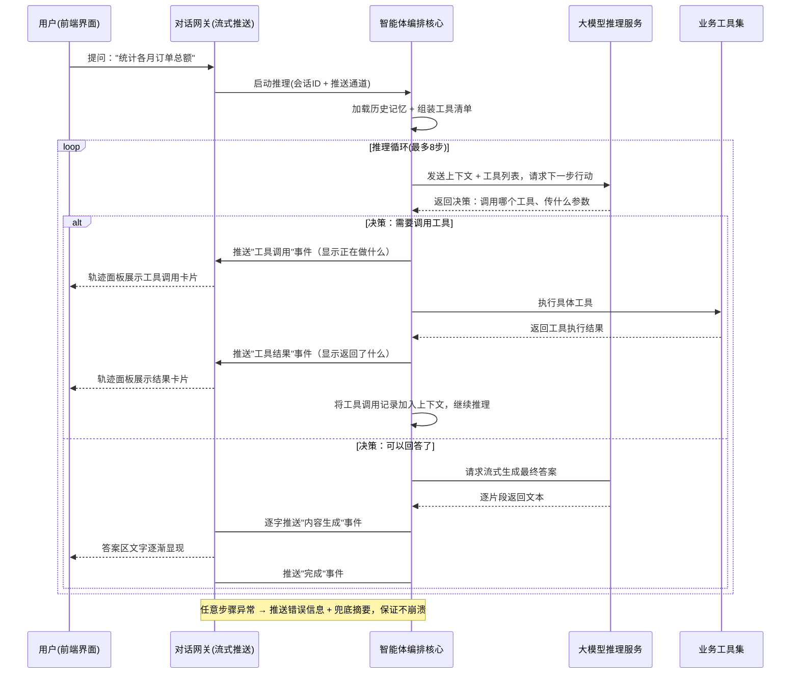

# agent_bi 智能体平台 — 产品功能设计说明书

> 文档版本：v1.2 ｜ 编制：产品与架构组 ｜ 配套：需求规格说明书、系统技术架构方案、数据库设计说明书
> 说明：本文档聚焦「系统能做什么、每个功能模块如何运转」，面向产品评审与技术交接。不贴实现代码。

---

## 一、产品定位与业务价值

### 1.1 我们解决什么问题

企业在数字化转型过程中积累了大量业务数据（订单、客户、产品、营收、预警等），但**真正需要用数据做决策的人——管理者、业务分析师、一线执行人员——绝大多数不会写 SQL**。传统模式下，他们取数必须走 IT 排期，响应慢、链路长，数据分析能力被严重瓶颈化。

agent_bi 的核心使命是：**让任何不懂技术的人，用自然语言对话的方式，直接从数据库里拿到答案和图表**。

### 1.2 目标用户画像

| 角色 | 典型场景 | 核心诉求 |
|------|----------|----------|
| **企业管理者** | 「本月销售趋势怎么样？」「哪些指标已经触发预警了？」 | 一句话看到全局概览，不需要等报表 |
| **业务分析师** | 「按地区统计订单量并对比去年」「客户复购率怎么算？」 | 自助取数、灵活组合维度，不依赖IT |
| **一线执行人** | 「帮我查一下客户 X 最近的所有订单」「这条预警为什么触发了？」 | 快速定位明细数据，理解业务规则 |

### 1.3 一句话产品描述

> **agent_bi 是一个「对话即分析」的智能数据助手**——用户用自然语言提问，系统自主完成「理解意图 → 查表结构 → 写 SQL 并执行 → 校验结果 → 选图表 → 解读结论」的全过程，每一步推理过程实时可见、可追溯。

---

## 二、系统整体架构

### 2.1 分层架构总览

系统采用经典的五层架构，自上而下为：

| 层次 | 职责 | 关键组件 |
|------|------|----------|
| **前端展示层** | 用户交互界面（对话/轨迹/图表） | Vue3 界面框架 + Element Plus 组件库 + ECharts 图表库（独立前端工程） |
| **接入层** | 身份鉴权拦截 + 实时流式推送网关 | Sa-Token 登录校验、对话控制器（SSE 推送端点） |
| **智能体编排层** | 多步推理循环（ReAct）、工具调度、记忆管理 | 智能体主服务（手写推理编排）、会话记忆管理器、七大业务工具 |
| **业务服务层** | 领域能力封装（查数/知识/预警/图表） | 自然语言转 SQL 引擎、知识库检索引擎、预警规则引擎、图表选型器 |
| **数据存储层** | 系统元数据 + 向量索引 + 动态业务库 | PostgreSQL 数据库（系统表 + 向量检索能力）、MySQL 数据库（动态接入） |

### 2.2 模块依赖关系

```
前端界面工程
   │  加密连接 / 对话接口（SSE 流式推送）
   ▼
接入层 ──▶ 身份鉴权校验 ──▶ 对话控制器（SSE 端点）
   │
   ▼
智能体编排层 ──▶ 主服务（推理主循环）
   │              ├── 会话记忆（多轮上下文，保留最近10轮）
   │              ├── 大模型调用服务
   │              └── 七大业务工具 ↓
   │
   ▼
业务服务层
   ├── 数据表探查 / 字段探查  ──▶ 动态连接目标数据库读取元数据
   ├── 自然语言转查询 / 安全查询执行  ──▶ NL2SQL 引擎 + 只读执行（五层防护）
   ├── 业务知识检索                 ──▶ 向量语义检索（pgvector）
   ├── 智能图表选型                 ──▶ 图表类型匹配 + 图表配置生成
   └── 预警分析                      ──▶ 规则检查 + 智能异常解读
   │
   ▼
存储层
   ├── PostgreSQL 系统库（业务配置表 + 向量索引字段）
   └── MySQL 业务库（通过数据源配置表动态接入）
```

> 📎 **配套可视化架构图**：详见项目总览文档中的架构图。

---

## 三、核心功能：多步推理对话（F01）

这是整个产品的**核心引擎**。不同于传统的"一问一答"式聊天机器人，agent_bi 采用 **ReAct（推理 + 行动）** 推理模式：

### 3.1 工作原理

用户提出一个问题后，智能体不会直接"猜"答案，而是像一个经验丰富的分析师一样**自主规划解题路径**：

1. **先想**：我需要查哪些表？用什么字段？
2. **再做**：调取相应的工具获取信息（查表结构、写查询语句执行、检索知识库…）
3. **再想**：拿到了中间结果，下一步该做什么？
4. **循环**：重复以上步骤，直到信息足够给出最终答案
5. **输出**：将完整的推理过程和最终答案以流式方式推送给用户

### 3.2 推理流程时序



### 3.3 关键设计机制

| 机制 | 说明 | 设计目的 |
|------|------|----------|
| **步数上限** | 单轮对话最多调用 8 次工具 | 防止死循环、控制成本 |
| **异常兜底** | 任何一步出错不会导致崩溃，而是推送错误信息 + AI 生成的摘要 | 保证用户体验流畅 |
| **记忆窗口** | 保留最近 10 轮对话上下文 | 控制推理资源消耗、保持关联性 |
| **流式推送** | 每一步操作和最终答案都以实时流式方式推送 | 过程透明、减少等待焦虑 |

---

## 四、十大功能模块详解（F01–F10）

智能体的所有业务能力通过以下标准化功能模块提供。每个模块都有明确的职责边界和输入输出规范。

### 4.1 功能一览表

| 编号 | 功能名称 | 一句话描述 |
|------|----------|-----------|
| F01 | **多步推理对话**（智能体编排） | 自主规划、循环调用工具直至得出答案 |
| F02 | **数据表探查** | 列出业务库全部表（含表名中文备注） |
| F03 | **字段探查** | 列出指定表的字段详情（字段名+类型+备注） |
| F04 | **自然语言转查询** | 将自然语言转为结构化查询语句并取数（返回结果集/列定义/行数/图表类型/前20行/解读） |
| F05 | **安全查询执行** | 执行只读查询（五层安全防护 + 表名白名单，限100行） |
| F06 | **业务知识检索** | 从知识库中按语义相似度查找相关业务口径定义 |
| F07 | **智能图表选型** | 根据数据特征自动匹配最佳图表类型并生成图表配置 |
| F08 | **预警分析** | 分析指定预警规则是否触发、级别及 AI 原因解读 |
| F09 | **流式推理轨迹推送** | 通过 SSE 协议实时推送六类事件（工具调用/工具结果/推理过程/内容生成/完成/错误） |
| F10 | **用户登录鉴权** | 基于令牌的登录校验，全局拦截所有接口请求 |

### 4.2 F01 多步推理对话（核心引擎）

**定位**：整个系统的"大脑"，负责将用户的自然语言问题拆解为有序的工具调用序列。

| 项目 | 说明 |
|------|------|
| 输入 | 用户提出的自然语言问题 + 会话标识 |
| 处理逻辑 | 构建系统提示词 + 加载历史记忆 + 注册七大工具清单 → 调用大模型推理 → 循环解析模型返回的工具调用指令 → 分发到对应工具执行 → 将执行结果回填上下文 → 继续下一轮推理，直至模型判断可给出最终答案 |
| 输出 | 流式事件序列（详见 F09） |
| 业务规则 | 单轮对话工具调用不超过 8 次；超限时自动终止并基于已有信息生成兜底摘要 |

### 4.3 F02 数据表探查

**定位**：让智能体在执行查询之前，先了解"有哪些表可以用"。

| 项目 | 说明 |
|------|------|
| 输入 | 数据源编号（默认使用已启用启的数据源） |
| 处理逻辑 | 依据数据源配置表中的连接信息，动态建立数据库连接 → 读取数据库元数据 → 提取所有可用表名及备注 |
| 输出 | 表名列表，每张表附带中文备注说明 |
| 安全约束 | 仅读取元数据字典，不触碰任何业务数据行 |

### 4.4 F03 字段探查

**定位**：让智能体了解某张具体表"有哪些字段、分别是什么类型"。

| 项目 | 说明 |
|------|------|
| 输入 | 数据源编号 + 表名 |
| 处理逻辑 | 连接目标数据库 → 读取指定表的列定义信息（字段名/数据类型/是否允许空值/注释说明） |
| 输出 | 字段清单，包含字段名、数据类型、字段说明 |
| 安全约束 | 同上，仅读元数据 |

### 4.5 F04 自然语言转查询（NL2SQL）

**定位**：最核心的业务工具——把人话翻译成数据库能执行的查询语句，并自动执行取数。

| 项目 | 说明 |
|------|------|
| 输入 | 用户的自然语言问题 + 数据源编号 |
| 处理流程 | ① 先去知识库检索相关业务术语定义（消解歧义）→ ② 结合表结构信息生成查询语句 → ③ 自动执行该语句 → ④ 判断返回数据的特征适合用什么图表展示 → ⑤ 截取前20条样本数据 → ⑥ 让大模型对数据进行解读分析 |
| 输出内容 | 生成的查询语句 / 返回列的定义 / 总行数 / 推荐图表类型 / 图表标题 / 前20行样本数据 / AI 数据洞察 |

**业务术语消解示例**：当用户说"利润"时，系统会先从知识库确认当前业务场景下指的是"毛利""净利"还是"营业利润"，避免因同词不同义导致查错数据。

### 4.6 F05 安全查询执行

**定位**：当需要补充查询或精确控制查询条件时的安全执行通道。

**五层安全防护体系**（逐层拦截，任一层不通过即拒绝执行）：

| 层级 | 检查项 | 说明 |
|------|--------|------|
| 第1层 | **语句类型白名单** | 仅允许数据查询语句（SELECT）和通用表达式（WITH） |
| 第2层 | **语句类型黑名单** | 拒绝所有数据修改语句（INSERT/UPDATE/DELETE）和结构变更语句（DROP/ALTER/TRUNCATE） |
| 第3层 | **注入特征检测** | 拒绝典型注入攻击模式（注释拼接、"恒真"拼接、联合查询注入等） |
| 第4层 | **多语句检测** | 拒绝分号分隔的多段语句（防止堆叠注入） |
| 第5层 | **表名白名单校验** | 所有被引用的表必须在数据表探查返回的白名单范围内 |

此外还有**结果数量限制**：单次查询最多返回 100 行数据，防止大量数据拖库。

### 4.7 F06 业务知识检索

**定位**：当问题涉及业务术语、指标定义、计算口径时，从企业知识库中检索标准答案。

| 项目 | 说明 |
|------|------|
| 输入 | 检索关键词 + 返回条数（默认3-5条） |
| 技术原理 | 将查询文本通过嵌入模型转换为向量表示 → 在向量数据库中做相似度匹配搜索 → 同时以关键词模糊匹配作为兜底保障 |
| 输出 | 命中的知识条目（标题/正文内容/所属业务领域/匹配程度评分） |

**知识来源支持**：
- 管理员手动录入维护
- OCR 文档识别（对接文档文字识别服务）
- 文件上传后自动切片入库

### 4.8 F07 智能图表选型

**定位**：根据查询结果的**数据特征**，自动选择最合适的图表类型并生成可直接渲染的图表配置。

| 数据特征 | 推荐图表 |
|----------|----------|
| 时间序列 + 单个数值指标 | 折线图（适合观察趋势变化） |
| 分类维度 + 单个数值指标 | 柱状图（适合对比大小） |
| 分类维度 + 双数值指标 | 组合图（柱状+折线叠加） |
| 占比/构成分析 | 饼图或环形图 |
| 多维度交叉分析 | 数据透视表格 |

**输出**：标准的图表配置数据，前端图表组件可直接渲染展示。

### 4.9 F08 预警分析

**定位**：对系统中配置的数据预警规则进行即时检查，并给出智能化的原因分析。

| 项目 | 说明 |
|------|------|
| 输入 | 预警规则编号 |
| 处理 | ① 读取规则定义（阈值/比较方式/检查查询语句）→ ② 执行检查查询获取当前实际值 → ③ 与阈值比较判断是否触发告警 → ④ 若启用智能分析则生成异常原因的深度解读 |
| 输出 | 当前实际值 / 设定阈值 / 是否触发 / 预警等级（提示/警告/错误/严重）/ AI 分析意见 |

### 4.10 F09 流式推理轨迹推送

**定位**：将推理过程的每一步通过服务端推送协议实时呈现给用户。

| 事件类型 | 含义 | 前端表现 |
|----------|------|----------|
| 工具调用 | 智能体决定调用某个功能模块 | 轨迹面板出现工具调用卡片（显示功能名称+参数） |
| 工具结果 | 功能模块执行完毕返回结果 | 轨迹面板出现结果卡片（表格或文本形式） |
| 推理过程 | 模型的中间思考过程 | 轨迹面板出现推理文本块 |
| 内容生成 | 最终答案逐字逐句生成 | 对话区文字逐步显现（打字机效果） |
| 完成 | 全部推理结束 | 显示"完成"标记，允许发起新提问 |
| 错误 | 出现异常 | 红色错误提示 + AI 兜底摘要 |

### 4.11 F10 用户登录鉴权

| 项目 | 方案 |
|------|------|
| 登录方式 | 用户名 + 密码提交 |
| 会话管理 | 登录成功后颁发访问令牌，后续每次请求需携带该令牌 |
| 拦截范围 | 所有业务接口（登录/登出/跨域预检除外） |
| 失效处理 | 令牌过期或无效 → 返回未授权错误 → 前端跳转登录页 |

---

## 五、交互体验设计

### 5.1 界面组成

| 组件 | 功能 | 交互亮点 |
|------|------|----------|
| **登录页** | 用户身份验证 | 令牌鉴权，错误友好提示 |
| **主对话页** | 核心交互界面 | 流式答案逐字累加 + 可折叠的推理轨迹面板 + 中断按钮 + 明暗主题切换 |
| **轨迹面板** | 展示完整推理过程 | 默认折叠节省空间，可展开查看每一步操作细节 |
| **图表块** | 渲染可视化图表 | 支持多种图表类型的自适应渲染 |
| **主题系统** | 明亮 / 暗黑双主题 | 样式变量驱动，切换无需刷新页面 |

### 5.2 关键交互细节

- **流式打字效果**：最终答案不是一次性弹出，而是像真人打字一样逐字出现，减少等待焦虑
- **过程可中断**：用户随时可以点击"停止"按钮中止当前推理
- **轨迹可审计**：完整保留每一步"想了什么→做了什么→得到了什么"，支持事后回溯审查
- **多轮连贯**：在同一会话中，系统记得之前的问答上下文，支持追问（如"那去年同期呢？"）

---

## 六、安全与权限体系

### 6.1 数据安全核心原则

> **系统内的所有角色（包括管理员）均只能执行只读查询，不具备任何写入数据库的能力。**

### 6.2 安全防护矩阵

| 风险点 | 防护措施 |
|--------|----------|
| 数据注入 / 越权修改 | 五层安全校验 + 表名白名单；仅开放只读查询能力 |
| 工具调用陷入死循环 | 单轮上限 8 次，超限自动终止并返回摘要 |
| 大模型幻觉导致危险操作 | 五层查询防护 + 工具接口仅暴露安全能力 |
| AI 密钥泄露风险 | 密钥仅存储于运行环境变量中，不入库、不写入配置文件 |
| 未授权接口访问 | 全局身份校验拦截，未登录一律拒绝 |

---

## 七、记忆与会话管理

### 7.1 多轮对话记忆

| 特性 | 说明 |
|------|------|
| 存储结构 | 按「会话编号」隔离的消息队列 |
| 内容格式 | 标准化对话消息格式（系统提示/用户输入/助手回复/工具调用） |
| 窗口大小 | 保留最近 **10 轮**对话，超出部分自动丢弃最早的记录 |
| 设计目的 | 平衡上下文连贯性与推理成本 |

### 7.2 会话隔离

不同用户、不同会话之间的对话记录完全互不可见。每个会话编号对应独立的记忆空间。

---

## 八、异常处理策略

系统遵循**"永不崩溃"原则**——任何环节出现异常都不会导致服务挂掉或前端卡死。

| 异常场景 | 处理方式 | 用户感知 |
|----------|----------|----------|
| 大模型推理超时或报错 | 推送错误事件 + AI 生成兜底摘要 | 看到错误提示和简化版答案 |
| 查询语句执行出错 | 将错误信息作为工具结果返回，智能体可自我纠正或换思路重试 | 可能看到"换个方式试试" |
| 安全校验未通过 | 返回具体的拦截原因说明 | 看到"该操作不符合安全规范"的明确提示 |
| 未登录访问接口 | 返回未授权错误，前端引导至登录页 | 被引导到登录页面 |
| 推理步数超限（超过8步） | 终止循环，返回基于已有信息的摘要结论 | 得到一个"尽力而为"的答案 |

---

*—— 本文档完 ——*
