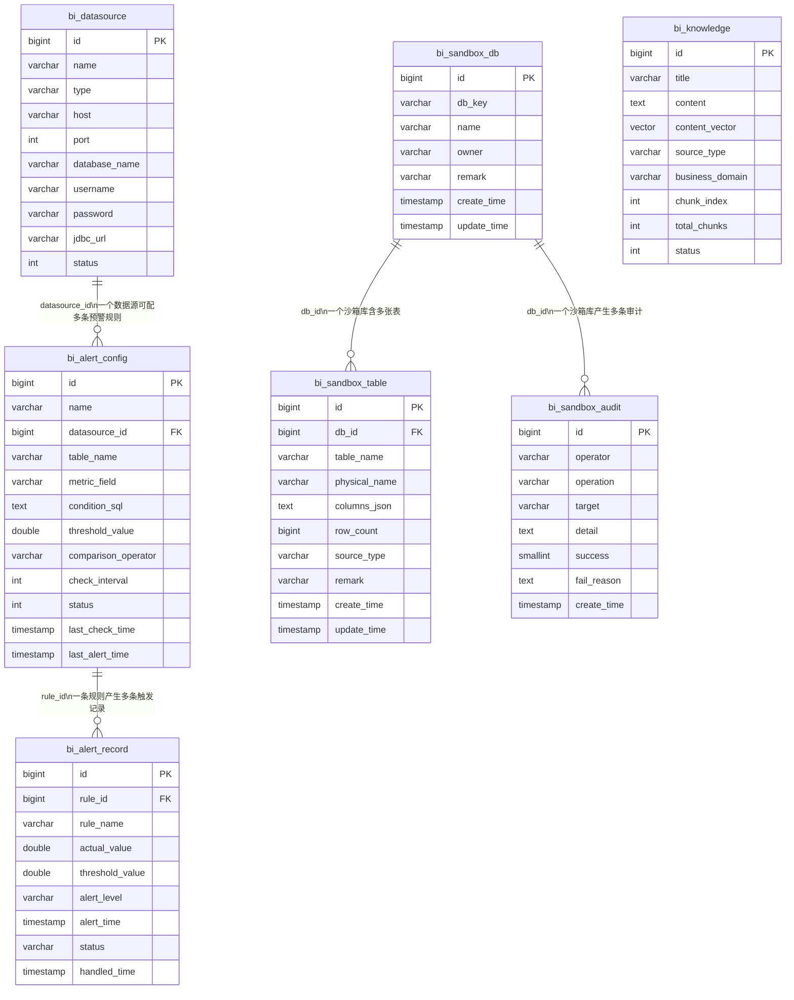

# agent_bi 智能体平台 — 数据库设计说明书

> 文档版本：v2.2（2026-08-05 修订）｜ 编制：架构组 ｜ 配套：需求规格说明书、功能详细设计文档、详细技术实现方案、RELEASE_NOTES.md
> **v2.1 修订要点**：废弃「ry 系统库 + 独立 MySQL 业务库」双库方案，改为**单库 `agent_bi`**（独立于 ai_bi 共用的 `ry` 库），系统表与多域业务星型表同库共存；初始化 DDL 与种子数据合并为**单一可信源** `src/main/resources/schema.sql` + `data.sql`，由 `spring.sql.init` 在应用启动时自动执行（幂等，重跑安全）。新增数据沙箱三表（bi_sandbox_db / bi_sandbox_table / bi_sandbox_audit）及 ER 关系。
> **v2.2 修订要点（2026-08-05）**：新增 P3 两张表 `bi_query_history`（查询历史）与 `bi_notify`（站内信通知）的结构定义（见 §2.6），并补充 `bi_dashboard`（大屏配置）、`bi_ocr_record`（OCR 识别记录）；全部 `bi_*` 表以 `schema.sql` 为单一可信源、启动自动建表。
> 说明：本文档完整描述 agent_bi 平台涉及的所有数据库表结构、字段定义、索引策略及 ER 关系。

---

## 一、数据库总体架构

### 1.1 存储分层设计

agent_bi 采用**「单库双用」**的存储架构：系统配置表与多域业务星型表共存于同一个 PostgreSQL 数据库 `agent_bi` 中（区别于 ai_bi 共用的 `ry` 库）。

```
┌─────────────────────────────────────────────────────────┐
│              PostgreSQL 数据库：agent_bi                  │
│  （独立于 ai_bi 共用的 ry 库，专供 agent_bi 使用）      │
│                                                         │
│  ┌──────────┐ ┌──────────┐ ┌───────────┐             │
│  │bi_       │ │bi_       │ │bi_        │  ← 系统表    │
│  │datasource│ │knowledge │ │alert_*    │             │
│  │数据源配置 │ │知识+向量  │ │预警体系   │             │
│  └──────────┘ └────┬─────┘ └───────────┘             │
│  维度表(dim_*)  事实表(fact_*)  ← 多域业务星型模型    │
│  region/category/product/customer + sales/inventory/month  │
│                                                         │
│  + pgvector 扩展 → bi_knowledge.content_vector(1024维)    │
└──────────────────────────┬──────────────────────────────┘
                           │ 动态JDBC（bi_datasource id=10 指向自身）
                           ▼
              ┌────────────────────────┐
              │  NL2SQL 直查业务星型表  │
              │  fact_sales_order 等     │
              └────────────────────────┘
```

### 1.2 库职责划分

| 库 | 类型 | 用途 | 管理方式 |
|----|------|------|----------|
| **PostgreSQL `agent_bi`** | 系统主库 + 业务库（单库双用） | 同时存储 BI 平台元数据/配置/知识库向量/预警数据 **与** 多域业务星型表（dim_*/fact_*） | 由 `src/main/resources/schema.sql`（建表）+ `data.sql`（种子）在应用启动时经 `spring.sql.init` 自动初始化（幂等） |
| **pgvector（PG 扩展）** | 向量引擎 | 为 RAG 检索提供余弦相似度计算能力 | PG 内置扩展，`content_vector` 列类型为 `vector(1024)` |

### 1.3 设计原则

- **单库双用**：`agent_bi` 同一库同时承担系统配置表（bi_*）与多域业务星型表（dim_*/fact_*），区别于 ai_bi 共用的 `ry` 库
- **动态数据源指向自身**：`bi_datasource` (id=10) 指向 `agent_bi` 自身，NL2SQL 直接查询同库业务表，验证动态 JDBC 链路
- **只读安全**：智能体对业务表仅有只读查询权限，零写操作
- **沙箱边界隔离**：数据沙箱复用系统库内的独立 `sandbox` schema，写工具均标记需用户确认 + 审计留痕，绝不越权访问 public 业务表或 bi_* 系统表
- **向量维度锁定**：统一使用 BAAI/bge-m3 的 1024 维嵌入，与 PG `vector(1024)` 严格匹配

---

## 二、系统库表结构详解（PostgreSQL agent_bi）

### 2.1 bi_datasource — 动态数据源配置表

**用途**：注册和管理所有可接入的业务数据库连接信息。智能体在执行 SQL 查询时，根据此表配置动态建立 JDBC 连接。

```sql
CREATE TABLE bi_datasource (
    id              BIGSERIAL PRIMARY KEY,
    name            VARCHAR(100)  NOT NULL,          -- 数据源显示名称
    type            VARCHAR(20)   NOT NULL,          -- 数据库类型: mysql / postgresql / oracle / sqlserver
    host            VARCHAR(200)  NOT NULL,          -- 主机地址
    port            INT           NOT NULL DEFAULT 3306,  -- 端口号
    database_name   VARCHAR(100)  NOT NULL,          -- 数据库名
    username        VARCHAR(100)  NOT NULL,          -- 连接用户名
    password        VARCHAR(500),                    -- 连接密码（加密存储）
    jdbc_url        VARCHAR(500),                    -- JDBC 连接串（系统根据上述字段自动生成）
    status          INT           DEFAULT 0,         -- 状态: 0=停用, 1=启用
    description     VARCHAR(500),                    -- 备注说明
    create_by       VARCHAR(64),
    create_time     TIMESTAMP     DEFAULT CURRENT_TIMESTAMP,
    update_by       VARCHAR(64),
    update_time     TIMESTAMP     DEFAULT CURRENT_TIMESTAMP,
    remark          VARCHAR(500)
);
```

**关键字段说明**：

| 字段 | 约束 | 说明 |
|------|------|------|
| `id` | PK, 自增 | 全局唯一标识 |
| `type` | NOT NULL | 决定 JDBC 驱动类和 URL 格式模板 |
| `password` | 加密存储 | 敏感信息，不应明文展示 |
| `jdbc_url` | 系统生成 | 由 `BiDataSourceFactory` 根据 type/host/port/dbname 自动拼接 |
| `status` | 0/1 | 仅 `status=1` 的数据源会被工具调用时使用 |

**核心业务规则**：
- 同一主机+端口+数据库的组合不重复创建
- 修改连接信息后，下次查询时自动使用新配置重建连接池
- 密码修改后旧连接失效

---

### 2.2 bi_knowledge — RAG 业务知识库表

**用途**：存储企业业务知识条目（指标定义、口径说明、计算公式等），支持全文内容和向量化双重检索。是 RAG（检索增强生成）的核心数据基础。

```sql
-- 需要 pgvector 扩展已安装
CREATE EXTENSION IF NOT EXISTS vector;

CREATE TABLE bi_knowledge (
    id              BIGSERIAL PRIMARY KEY,
    title           VARCHAR(500)  NOT NULL,           -- 知识标题
    content         TEXT          NOT NULL,           -- 知识内容正文（切片后）
    content_vector  vector(1024),                     -- 内容嵌入向量（BAAI/bge-m3, 1024维）
    source_type     VARCHAR(20),                     -- 来源: manual / ocr / file
    source_url      VARCHAR(500),                    -- 来源URL或文件路径
    business_domain VARCHAR(100),                    -- 所属业务领域: 财务 / 销售 / 库存 / 运营 ...
    tags            VARCHAR(500),                    -- 标签（逗号分隔）
    chunk_index     INT,                             -- 文档切片序号（同一文档拆分为多个chunk）
    total_chunks    INT,                             -- 该文档的总切片数
    status          INT           DEFAULT 1,         -- 状态: 0=停用, 1=启用
    create_by       VARCHAR(64),
    create_time     TIMESTAMP     DEFAULT CURRENT_TIMESTAMP,
    update_by       VARCHAR(64),
    update_time     TIMESTAMP     DEFAULT CURRENT_TIMESTAMP,
    remark          TEXT
);
```

**关键字段说明**：

| 字段 | 类型 | 说明 |
|------|------|------|
| `content` | TEXT | 知识正文。长文档会被切片为多个 chunk，每个 chunk 一行 |
| `content_vector` | **vector(1024)** | pgvector 类型，存储 bge-m3 嵌入模型的 1024 维浮点向量。Java 侧以字符串形式传递（如 `"[0.1,-0.2,...]"`），入库时由 Mapper 通过 `CAST(? AS vector)` 转换 |
| `source_type` | VARCHAR(20) | 三种来源：`manual`=手动录入、`ocr`=OCR识别、`file`=文件上传 |
| `business_domain` | VARCHAR(100) | 用于按领域过滤检索范围 |
| `chunk_index` / `total_chunks` | INT | 支持长文档切片策略；同一 `source_url` 下 chunk_index 从 0 到 total_chunks-1 |

**向量检索原理**：
1. 用户提问文本经 bge-m3 模型转为 1024 维 query vector
2. 在 PG 中执行 `<=>` 余弦距离运算，找出最相似的 knowledge 条目
3. 同时以 ILIKE 2-gram 做关键词兜底（防止 embedding 模型不可用时完全无法检索）
4. 两种结果合并去重后返回 topK 条

---

### 2.3 bi_alert_rule（即 bi_alert_config）— 预警规则配置表

> ⚠️ 注意：实体类 `BiAlertRule` 映射的是数据库中的 `bi_alert_config` 表（见类注释）。此处沿用代码中的命名习惯。

**用途**：定义数据预警规则——监控什么指标、用什么条件判断、达到什么阈值触发告警、通知给谁。

```sql
CREATE TABLE bi_alert_config (
    id                  BIGSERIAL PRIMARY KEY,
    name                VARCHAR(200)  NOT NULL,       -- 规则名称
    datasource_id       BIGINT,                       -- 关联的数据源ID（→ bi_datasource.id）
    table_name          VARCHAR(100),                 -- 监控的目标表名
    metric_field        VARCHAR(100),                 -- 被监控的字段名
    condition_sql       TEXT,                         -- 检查SQL（查出当前值）
    threshold_value     DOUBLE PRECISION,             -- 阈值
    comparison_operator VARCHAR(10),                  -- 比较算子: > / < / >= / <= / = / !=
    check_interval      INT,                          -- 检查间隔（分钟）
    notify_type         VARCHAR(100),                 -- 通知方式: email,sms,wechat（逗号分隔）
    notify_target       VARCHAR(500),                 -- 通知目标（邮箱/手机号等）
    status              INT           DEFAULT 0,      -- 0=停用, 1=启用
    analysis_enabled    INT           DEFAULT 0,      -- 是否启用AI异常分析: 0=否, 1=是
    last_check_time     TIMESTAMP WITHOUT TIME ZONE,  -- 上次执行检查的时间
    last_alert_time     TIMESTAMP WITHOUT TIME ZONE,  -- 上次触发预警的时间
    create_by           VARCHAR(64),
    create_time         TIMESTAMP     DEFAULT CURRENT_TIMESTAMP,
    update_by           VARCHAR(64),
    update_time         TIMESTAMP     DEFAULT CURRENT_TIMESTAMP,
    remark              TEXT
);
```

**关键字段说明**：

| 字段 | 说明 |
|------|------|
| `condition_sql` | 一条 SELECT 语句，用于从目标表中查出当前被监控指标的值。如 `SELECT SUM(amount) FROM demo_order WHERE created_at > NOW() - INTERVAL '30 days'` |
| `threshold_value` + `comparison_operator` | 阈值判断对。如 threshold=10000 + operator=`<` 表示"当值低于10000时触发" |
| `check_interval` | 由 Quartz 定时任务驱动，每隔 N 分钟执行一次检查 |
| `analysis_enabled` | 触发预警时是否额外调 LLM 做异常原因分析（增加成本但提升价值） |
| `last_check_time` / `last_alert_time` | 时间戳类型，非字符串（代码质量红线要求） |

---

### 2.4 bi_alert_record — 预警触发记录表

**用途**：每次预警规则检查并判定触发后，写入一条记录存证。支持后续的预警历史查询、处理跟踪和统计分析。

```sql
CREATE TABLE bi_alert_record (
    id              BIGSERIAL PRIMARY KEY,
    rule_id         BIGINT,                        -- 关联的预警规则ID（→ bi_alert_config.id）
    rule_name       VARCHAR(200),                  -- 规则名称（冗余存储，避免联查）
    datasource_id   BIGINT,                        -- 数据源ID
    table_name      VARCHAR(100),                  -- 涉及的表名
    check_sql       TEXT,                          -- 实际执行的检查SQL
    threshold_value DOUBLE PRECISION,              -- 阈值
    actual_value    DOUBLE PRECISION,              -- 实际检测到的值
    comparison_operator VARCHAR(10),               -- 比较算子
    alert_message   TEXT,                          -- 预警消息文本
    analysis_result TEXT,                          -- AI 异常分析结果（若启用）
    alert_level     VARCHAR(20),                   -- 预警级别: info / warning / error / critical
    alert_time      TIMESTAMP WITHOUT TIME ZONE,    -- 预警触发时间
    status          VARCHAR(20)   DEFAULT 'pending',-- 处理状态: pending / acknowledged / resolved
    handled_by      VARCHAR(64),                   -- 处理人
    handled_time    TIMESTAMP WITHOUT TIME ZONE,    -- 处理时间
    handled_remark  TEXT                           -- 处理备注
);
```

**关键字段说明**：

| 字段 | 说明 |
|------|------|
| `rule_name` | 冗余字段，从 `bi_alert_config.name` 快照写入，避免每次展示都需 JOIN |
| `actual_value` | 检查 SQL 的实际返回值，与 `threshold_value` 对比后决定是否触发 |
| `alert_level` | 枚举值（非魔法字符串）：`info`（信息）/ `warning`（警告）/ `error`（错误）/ `critical`（严重） |
| `status` | 处理流程状态：`pending`（待处理）→ `acknowledged`（已确认）→ `resolved`（已解决） |
| `analysis_result` | 当规则的 `analysis_enabled=1` 时，LLM 生成的异常原因分析文本 |

---

### 2.5 数据沙箱相关表

> 数据沙箱物理上共用 `agent_bi` 库内的 `sandbox` schema，与 public 业务表及 bi_* 系统表相互隔离。以下三张 `bi_sandbox_*` 表记录沙箱的元数据与操作审计，不存放实际业务数据。

#### 2.5.1 bi_sandbox_db — 沙箱库（逻辑命名空间）

**用途**：登记数据沙箱的逻辑命名空间（如 `marts`），每个命名空间对应 `sandbox` schema 下的一组物理表。用于隔离不同主题/租户的沙箱数据。

```sql
CREATE TABLE bi_sandbox_db (
    id          BIGSERIAL PRIMARY KEY,                -- 沙箱库ID
    db_key      VARCHAR(64)  NOT NULL,                -- 英文唯一标识（如 marts）
    name        VARCHAR(100),                         -- 展示名（可中文）
    owner       VARCHAR(64),                          -- 归属人/团队
    remark      VARCHAR(500),                         -- 备注
    create_time TIMESTAMP   DEFAULT CURRENT_TIMESTAMP,-- 创建时间
    update_time TIMESTAMP   DEFAULT CURRENT_TIMESTAMP,-- 更新时间
    CONSTRAINT uk_db_key UNIQUE (db_key)              -- 标识唯一
);
```

#### 2.5.2 bi_sandbox_table — 沙箱表元数据

**用途**：登记沙箱内每张表的结构与来源信息（克隆 / 粘贴 / 文件导入），便于 NL2SQL 检索可用表与列定义。

```sql
CREATE TABLE bi_sandbox_table (
    id            BIGSERIAL PRIMARY KEY,              -- 表元数据ID
    db_id         BIGINT       NOT NULL,              -- 所属沙箱库（→ bi_sandbox_db.id）
    table_name    VARCHAR(100) NOT NULL,              -- 短名（全沙箱唯一）
    physical_name VARCHAR(200) NOT NULL,              -- 物理表名（如 sandbox."表名"）
    columns_json  TEXT,                               -- 列类型 JSON
    row_count     BIGINT,                             -- 行数快照
    source_type   VARCHAR(20),                        -- 来源: clone / paste / file
    remark        VARCHAR(500),                       -- 备注
    create_time   TIMESTAMP   DEFAULT CURRENT_TIMESTAMP,-- 创建时间
    update_time   TIMESTAMP   DEFAULT CURRENT_TIMESTAMP,-- 更新时间
    CONSTRAINT uk_table_name UNIQUE (table_name)      -- 短名唯一
);
```

#### 2.5.3 bi_sandbox_audit — 操作审计

**用途**：记录沙箱内的写类操作（import / create / drop / materialize / rename 等），留痕操作人、成败与失败原因，支撑审计与回滚追溯。

```sql
CREATE TABLE bi_sandbox_audit (
    id          BIGSERIAL PRIMARY KEY,                -- 审计ID
    operator    VARCHAR(64),                          -- 操作人
    operation   VARCHAR(50),                          -- 操作类型: import/create/drop/materialize/rename…
    target      VARCHAR(200),                         -- 目标表
    detail      TEXT,                                 -- 详情
    success     SMALLINT,                             -- 1=成功 / 0=失败
    fail_reason TEXT,                                 -- 失败原因
    create_time TIMESTAMP   DEFAULT CURRENT_TIMESTAMP -- 操作时间
);
```

---

### 2.6 P3 及后续新增表

> 以下表随 v1.0.0 各阶段迭代加入，均为系统表，位于 `agent_bi` 库 `public` schema，由 `schema.sql` 自动创建。

#### 2.6.1 bi_query_history — NL2SQL 查询历史

**用途**：记录每次自然语言查询的执行结果，按 `user_id` 隔离，支持回溯 SQL、复现分析过程、统计耗时与成功率。

```sql
CREATE TABLE IF NOT EXISTS bi_query_history (
    id            BIGSERIAL PRIMARY KEY,
    user_id       VARCHAR(64),
    datasource_id BIGINT,
    query         TEXT,
    sql           TEXT,
    row_count     INT,
    duration_ms   BIGINT,
    status        VARCHAR(20),
    error_msg     TEXT,
    create_time   TIMESTAMP DEFAULT CURRENT_TIMESTAMP
);
```

#### 2.6.2 bi_notify — 站内信 / 用户通知

**用途**：预警触发与系统事件经站内信中心推送；邮件通道在配置 `spring.mail.host` 时并行发送，否则自动降级为站内信 + 日志（详见 RELEASE_NOTES.md「已知限制」）。

```sql
CREATE TABLE IF NOT EXISTS bi_notify (
    id          BIGSERIAL PRIMARY KEY,
    user_id     VARCHAR(64),
    rule_id     BIGINT,
    record_id   BIGINT,
    title       VARCHAR(200),
    content     TEXT,
    level       VARCHAR(20),
    is_read     INT           DEFAULT 0,
    create_time TIMESTAMP     DEFAULT CURRENT_TIMESTAMP
);
```

#### 2.6.3 其余新增表（一句话说明）

- `bi_dashboard` — BI 大屏配置表（名称 / 布局 `config_json` / 缩略图 / 分享 `access_token` / 公开标志）。
- `bi_ocr_record` — OCR 识别记录表（识别任务与结果留痕）。

---

## 三、ER 关系图



### 3.1 关系说明

| 关系 | 类型 | 含义 |
|------|------|------|
| `bi_datasource` → `bi_alert_config` | **一对多** | 一个数据源可以配置多条针对不同表/字段的预警规则 |
| `bi_alert_config` → `bi_alert_record` | **一对多** | 一条预警规则每次定时检查触发时都会新增一条记录 |
| `bi_knowledge` | **独立无外键** | 知识条目独立存在，通过 `business_domain` 字段逻辑关联业务领域 |
| `bi_sandbox_db` → `bi_sandbox_table` | **一对多** | 一个沙箱库（逻辑命名空间）下包含多张沙箱表 |
| `bi_sandbox_db` → `bi_sandbox_audit` | **一对多** | 一个沙箱库在执行写操作时产生多条审计记录 |
| `bi_alert_config` → `bi_notify` | **一对多** | 一条预警规则触发时生成对应站内信（`record_id` 关联 `bi_alert_record`） |
| `bi_query_history` | **独立无外键** | 查询历史按 `user_id` 逻辑隔离，无跨表外键 |

---

## 四、索引策略

### 4.1 各表索引清单

#### bi_datasource

| 索引名 | 字段 | 类型 | 用途 |
|--------|------|------|------|
| PRIMARY | `id` | BTREE（主键） | 行唯一标识 |
| idx_status | `status` | BTREE | 快速筛选启用/停用的数据源 |

#### bi_knowledge

| 索引名 | 字段 | 类型 | 用途 |
|--------|------|------|------|
| PRIMARY | `id` | BTREE（主键） | 行唯一标识 |
| idx_vector | `content_vector` | **ivfflat（HNSW可选）** | **向量余弦相似度搜索（RAG 核心索引）** |
| idx_domain | `business_domain` | BTREE | 按业务领域过滤知识条目 |
| idx_status | `status` | BTREE | 筛选启用的知识 |
| idx_tags | `tags` | GIN / BTREE | 标签检索（如需） |

> **关于向量索引**：pgvector 支持 `ivfflat` 和 `hnsw` 两种索引。当前数据量小（<10万条），线性扫描（<=> 运算符）性能足够；数据量增长后建议创建 HNSW 索引以提升召回速度。

#### bi_alert_config

| 索引名 | 字段 | 类型 | 用途 |
|--------|------|------|------|
| PRIMARY | `id` | BTREE（主键） | 行唯一标识 |
| idx_ds_id | `datasource_id` | BTIRE | 按数据源查找其下所有规则 |
| idx_status | `status` | BTREE | 只扫描启用的规则进行定时检查 |
| idx_check_interval | `check_interval` | BTREE | 按调度频率分组 |

#### bi_alert_record

| 索引名 | 字段 | 类型 | 用途 |
|--------|------|------|------|
| PRIMARY | `id` | BTREE（主键） | 行唯一标识 |
| idx_rule_id | `rule_id` | BTREE | 查询某规则的所有历史触发记录 |
| idx_alert_time | `alert_time` | BTREE | 按时间范围查询预警历史 |
| idx_level | `alert_level` | BTREE | 按级别筛选（如只看 critical） |
| idx_status | `status` | BTREE | 查询待处理的预警 |

#### 数据沙箱表

| 索引名 | 字段 | 类型 | 用途 |
|--------|------|------|------|
| PRIMARY | `id` | BTREE（主键） | 行唯一标识 |
| uk_db_key | `db_key` | BTREE | 沙箱库英文标识唯一 |

| 索引名 | 字段 | 类型 | 用途 |
|--------|------|------|------|
| PRIMARY | `id` | BTREE（主键） | 行唯一标识 |
| uk_table_name | `table_name` | BTREE | 沙箱表短名全沙箱唯一 |
| idx_db_id | `db_id` | BTREE | 按所属沙箱库查找其下表 |

| 索引名 | 字段 | 类型 | 用途 |
|--------|------|------|------|
| PRIMARY | `id` | BTREE（主键） | 行唯一标识 |
| idx_db_id | `db_id` | BTREE | 按沙箱库查询操作审计 |
| idx_create_time | `create_time` | BTREE | 按时间倒序查询审计流水 |

### 4.2 索引设计原则

1. **外键必索引**：所有 FK 字段（`datasource_id`, `rule_id`）均建索引，避免全表扫描
2. **状态字段索引**：`status` 是最高频的 WHERE 条件，每张表都建了
3. **时间字段索引**：`alert_time`, `last_check_time`, `create_time` 支持时间范围查询
4. **向量索引按需升级**：初期无需建 ivfflat/hnsw，数据量 > 5 万后再评估

---

## 五、MySQL 业务库（动态接入）

### 5.1 接入机制

业务表与系统表**同库共存于 `agent_bi`**，通过 `bi_datasource` 表（id=10，指向 `agent_bi` 自身）**运行时动态配置**。系统启动时读取该表，后续每次工具调用时按 `datasourceId` 参数选择对应的数据源连接（此处即连接回 `agent_bi` 同库，验证动态 JDBC 链路）。

### 5.2 演示环境当前配置

| 项目 | 值 |
|------|-----|
| 数据源 ID | 10 |
| 名称 | LocalPG-AgentBI |
| 类型 | postgresql |
| 地址 | localhost:5432 |
| 数据库 | agent_bi |
| 状态 | 启用 (status=1) |

### 5.3 当前演示业务表（多域星型模型：销售 / 库存 / 用户）

| 表名 | 类型 | 用途 | 关键字段概要 |
|------|------|------|-------------|
| `dim_region` | 维度 | 区域 | region_id, region_name, province, city, manager |
| `dim_category` | 维度 | 商品品类 | category_id, category_name, parent_category |
| `dim_product` | 维度 | 商品 | product_id, product_name, category_id, unit_price, cost_price, brand |
| `dim_customer` | 维度 | 客户（用户域） | customer_id, customer_name, region_id, level, gender, age, register_date, total_spent |
| `fact_sales_order` | 事实 | 销售订单（~600 行） | order_id, customer_id, product_id, region_id, category_id, quantity, unit_price, discount, amount, order_date, status, channel, payment |
| `fact_inventory` | 事实 | 库存快照（商品×区域） | snapshot_id, product_id, region_id, warehouse, stock_qty, safety_stock, snapshot_date, inbound_qty, outbound_qty |
| `fact_monthly_sales` | 事实 | 月度销售聚合（由订单派生） | id, year, month, region_id, category_id, product_id, total_orders, total_quantity, total_amount, total_cost, total_profit |

> 以上业务表均位于 PostgreSQL `agent_bi` 库（非 MySQL）。初始化 SQL 已合并为**单一可信源** `src/main/resources/schema.sql` + `data.sql`，由 `spring.sql.init` 在应用启动时自动执行；全部 `IF NOT EXISTS` / `ON CONFLICT` 幂等，可反复重跑，不会清空已有数据。

### 5.4 安全约束

- 智能体对业务库**只有只读权限**（JDBC 连接用户仅授予 SELECT 权限）
- 所有 SQL 经 `SqlValidator` 五层防护后才执行
- 单次查询最多返回 100 行

---

## 六、会话记忆（内存/Redis）

### 6.1 当前方案：内存存储

| 属性 | 值 |
|------|-----|
| 存储结构 | `Map<sessionId, Deque<Map<String,Object>>>` |
| 消息格式 | OpenAI 标准（system/user/assistant(tool_calls)/tool） |
| 窗口大小 | 最近 10 轮对话 |
| 生命周期 | 应用重启后清空 |

### 6.2 生产化方案：Redis（预留）

| 属性 | 设计 |
|------|------|
| Key 格式 | `agent:session:{sessionId}` |
| Value | JSON Array（消息列表） |
| 过期策略 | TTL = 30 分钟无活动自动清理 |
| 切换代价 | 仅改 `AgentMemory` 实现，上层 BiAgentService 无感知 |

> 当前阶段使用内存方案足够（单实例、开发/演示场景）；生产多实例部署时切换至 Redis 以支持跨节点会话共享。

---

## 七、数据字典总览

### 7.1 系统库全部 bi_ 表汇总

| 序号 | 表名 | 中文名 | 记录规模估算 | 更新频率 | 核心使用者 |
|------|------|--------|-------------|----------|-----------|
| 1 | `bi_datasource` | 数据源配置 | 1~50 条 | 低（运维操作） | BiDataSourceFactory / 工具层 |
| 2 | `bi_knowledge` | 业务知识库 | 百~万级 | 中（管理员维护） | rag_search 工具 / RAG 引擎 |
| 3 | `bi_alert_config` | 预警规则配置 | 10~500 条 | 低（运维操作） | BiAlertCheckTask / analyze_alert 工具 |
| 4 | `bi_alert_record` | 预警触发记录 | 千~百万级 | 高（定时任务写入） | 预警列表页 / 统计分析 |
| 5 | `bi_sandbox_db` | 沙箱库（逻辑命名空间） | 1~50 条 | 低 | 沙箱服务 |
| 6 | `bi_sandbox_table` | 沙箱表元数据 | 十~千级 | 中 | 沙箱服务 / NL2SQL |
| 7 | `bi_sandbox_audit` | 沙箱操作审计 | 千~万级 | 高 | 审计日志页 |
| 8 | `bi_query_history` | 查询历史 | 千~万级 | 高 | 查询历史页 |
| 9 | `bi_notify` | 站内信通知 | 千~万级 | 中 | 通知中心 |
| 10 | `bi_dashboard` | BI 大屏配置 | 十~百级 | 低 | 大屏管理 |
| 11 | `bi_ocr_record` | OCR 识别记录 | 百~千级 | 中 | OCR 历史 |

### 7.2 枚举值规范

| 字段 | 可选值 | 所在表 |
|------|--------|--------|
| `type`（数据源类型） | `mysql` / `postgresql` / `oracle` / `sqlserver` | bi_datasource |
| `status`（通用状态） | `0`=停用 / `1`=启用 | 所有表 |
| `source_type`（知识来源） | `manual` / `ocr` / `file` | bi_knowledge |
| `comparison_operator` | `>` / `<` / `>=` / `<=` / `=` / `!=` | bi_alert_config |
| `alert_level` | `info` / `warning` / `error` / `critical` | bi_alert_record |
| `record_status` | `pending` / `acknowledged` / `resolved` | bi_alert_record |

---

*—— 本文档完 ——*
